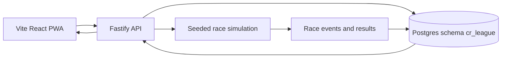

## adr_001_cr_league_v1_static_pwa_api_architecture - CR League V1 static PWA API architecture
> Date: 2026-07-13
> Status: Proposed
> Related request: `req_003_decide_cr_league_v1_application_architecture`
> Related backlog: `item_009_decide_cr_league_v1_application_architecture`
> Related task: `task_004_decide_cr_league_v1_application_architecture`
> Related product: `prod_001_cr_league_product_brief`
> Related specs: `spec_003_mvp_vertical_slice`, `spec_007_technical_architecture_v1`
> Drivers: rich client replay, server-authoritative simulation, Postgres persistence, low-cost hosting, lazy asynchronous race resolution
> Reminder: Update status, linked refs, decision rationale, consequences, and follow-up work when you edit this doc.

# Decision
Use a **static Vite React PWA** for the web app and a **dedicated Fastify API** backed by **Prisma/PostgreSQL** for CR League V1.

Recommended repository shape:

```txt
apps/
  web/       Vite + React + PWA
  api/       Fastify + Prisma
packages/
  shared/    shared types, card definitions, simulation contracts
prisma/
  schema.prisma
```

# Overview Diagram


The first implementation should follow the existing local pattern closest to CR League: `../cp-wc-26`, not the heavier Next.js fullstack pattern from `../PoleApp`.

# Context
CR League needs:

- rich client-side screens for team setup, briefing, preparation, replay, report, standings, cards, and inventory;
- server-authoritative race simulation;
- private leagues with short invite codes;
- persistent race inputs, event timelines, results, cards, credits, and standings;
- lazy race resolution so a sleeping server can resolve due races on first access;
- low-cost hosting;
- a path from solo vertical slice to private multiplayer without rewriting the core engine.

The user already has access to PostgreSQL and can use a dedicated database schema for this project.

Sibling project patterns inspected:

- `PoleApp`: Next.js + Prisma/PostgreSQL + NextAuth. Good for classic fullstack app with integrated auth and server-rendered routes.
- `cp-wc-26`: Vite static web + Fastify API + Prisma/PostgreSQL + lazy sync. Closest to CR League's asynchronous game model.
- `emberwake` and `fleet-sim`: Vite/PWA patterns for richer interactive client-side experiences.

# Options Considered
## Option A: Next.js fullstack
Pros:

- one application surface;
- established in `PoleApp`;
- simple route co-location;
- mature auth integrations.

Cons for CR League:

- SSR is not a core need;
- replay/game UI is client-heavy;
- static frontend cannot stay independently fast while the backend sleeps;
- NextAuth and server-rendering concerns add weight before the gameplay loop is proven;
- deployment is one larger web service instead of a cheap static app plus small API.

Use Next.js later only if CR League grows into a content-heavy, SEO-heavy, or auth-heavy app where integrated fullstack routing becomes more valuable than the split.

## Option B: Static PWA + dedicated API
Pros:

- matches game-like client experience;
- frontend can be static and cheap;
- backend owns persistence and simulation cleanly;
- aligns with `cp-wc-26`;
- lazy race resolution maps naturally to API access;
- easy to keep replay client-side from stored event timelines;
- no SSR tax.

Cons:

- two deployable surfaces;
- CORS/config must be managed;
- auth must be chosen explicitly;
- shared types/contracts need a small package.

This is the chosen V1 direction.

# Database Decision
Use PostgreSQL with Prisma.

Use a dedicated schema:

```txt
postgresql://.../database?schema=cr_league
```

Why:

- the user already has PostgreSQL available;
- Prisma/Postgres is already used in sibling projects;
- relational data fits leagues, teams, races, decisions, events, standings, and inventories;
- JSON can still store replay/event payloads where useful.

Core entities expected for V1:

- Player;
- Team;
- League;
- LeagueMember;
- Season;
- GrandPrix;
- RaceDecision;
- RaceResult;
- RaceEvent;
- CardDefinition;
- CardInventoryItem;
- CreditLedger or team credit balance.

Keep the first schema boring. Add constraints for idempotency and uniqueness where they prevent real duplication, especially race resolution and invite codes.

# Backend Decision
Use Fastify for the API.

Responsibilities:

- expose league/team/race/card endpoints;
- own server-authoritative race simulation;
- apply missing-player defaults;
- resolve due races idempotently;
- persist race seed, inputs, event timeline, results, rewards, and standings;
- generate invite codes;
- expose health/readiness endpoints.

Do not add a worker or queue in V1.

Lazy race resolution flow:

1. Client requests league or race state.
2. API checks whether the next Grand Prix is due.
3. API transactionally marks the race as resolving, or returns the stored result if already resolved.
4. API loads decisions and applies defaults for missing players.
5. API runs seeded simulation.
6. API stores result, events, consumed cards, credits, and standings.
7. API returns the stored result.

# Frontend Decision
Use Vite + React + PWA.

Responsibilities:

- team setup;
- solo vertical slice flow;
- league dashboard;
- briefing and preparation;
- cards and inventory;
- standings;
- race report;
- 2D replay rendered from stored event timeline.

Start with native browser features and simple rendering.

Replay recommendation:

- begin with SVG or Canvas;
- do not add Pixi.js until plain SVG/Canvas becomes measurably painful;
- no 3D in V1.

# Shared Package
Use `packages/shared` for contracts that must agree between web and API:

- card ids and card definitions;
- race decision types;
- race event types;
- race result shapes;
- simulation constants when they are safe to share;
- route response types if useful.

Keep it small. Do not build a large SDK before the API exists.

# Authentication Decision
Prototype:

- allow local/anonymous player identity for solo vertical slice;
- store enough local identity to play a short prototype.

Private multiplayer MVP:

- add stable player identity before real private leagues;
- invite code is not authentication by itself;
- joining a league should attach a player/team identity.

Avoid NextAuth in the first slice. Consider magic links or lightweight session tokens later when multiplayer needs real identity.

# Deployment Decision
Use Render-compatible deployment:

- `apps/web`: static service;
- `apps/api`: Node web service;
- PostgreSQL: existing database with `cr_league` schema.

The API may sleep in cheap hosting. The product accepts that because races are asynchronous and can resolve lazily on access.

No cron is required for V1 correctness.

# First Implementation Implications
The first implementation backlog should start with a solo vertical slice:

1. scaffold monorepo;
2. define Prisma schema subset;
3. add shared race/card types;
4. implement seedable simulation as pure functions;
5. add API endpoints for solo championship/race resolution;
6. build web preparation and report screens;
7. add minimal replay from event timeline;
8. persist standings, credits, and inventory.

Do not start with full private multiplayer. The architecture supports it, but the gameplay loop should be proven first.

# Non-goals
- No Next.js app for V1 unless requirements change.
- No SSR requirement.
- No always-on job worker.
- No queue system.
- No microservices.
- No full auth platform before the gameplay loop is proven.
- No Pixi.js or 3D dependency in the first slice.
- No production-scale public matchmaking architecture.

# Revisit Triggers
Reconsider this decision if:

- the app needs SEO/content-heavy public pages;
- authentication becomes the dominant complexity;
- replay rendering requires a real 2D engine;
- traffic or timing requirements make lazy race resolution unacceptable;
- multiplayer needs live synchronized viewing;
- deployment constraints make split static/API hosting worse than a single fullstack service.

# Validation Notes
This decision is based on local project inspection and current CR League product requirements. It should be revisited after the solo vertical slice playtest, not before.

# References
- Product brief: `prod_001_cr_league_product_brief`
- MVP vertical slice: `spec_003_mvp_vertical_slice`
- Technical architecture V1: `spec_007_technical_architecture_v1`
- Similar local pattern: `../cp-wc-26`
- Alternative local pattern: `../PoleApp`
