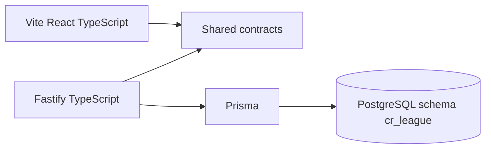

## adr_002_framework_stack - Framework Stack
> Date: 2026-07-13
> Status: Proposed
> Related request: `req_011_define_cr_league_engineering_adrs`
> Related backlog: `item_017_define_cr_league_engineering_adrs`
> Related task: `task_012_define_cr_league_engineering_adrs`
> Related architecture: `adr_001_cr_league_v1_static_pwa_api_architecture`
> Drivers: interactive PWA, server-authoritative simulation, low-cost hosting, local project consistency
> Reminder: Update status, linked refs, decision rationale, consequences, and follow-up work when you edit this doc.

# Overview Diagram

# Decision
Use:

- `apps/web`: Vite + React + TypeScript.
- `apps/api`: Fastify + TypeScript.
- `packages/shared`: TypeScript contracts and shared domain definitions.
- `prisma`: Prisma + PostgreSQL.

Do not use Next.js for V1.

# Rationale
- CR League is an interactive game UI, not a content/SEO-heavy app.
- Replay and preparation flows are client-heavy.
- The API should own race simulation, persistence, identity, credits, cards, and lazy resolution.
- This stack matches local project patterns from `cp-wc-26`.
- Static web + API keeps the frontend usable and cheap even when the API host sleeps.

# Rules
- Add new runtime dependencies only when the current stack clearly fails.
- Keep simulation deterministic and testable outside React components.
- Keep backend simulation server-authoritative.
- Keep `packages/shared` small: contracts, ids, data shapes, and safe shared constants only.
- Prefer browser/native APIs before new frontend libraries.

# Non-goals
- No Next.js unless SSR, SEO, or integrated auth becomes a dominant requirement.
- No separate backend language in V1.
- No microservices.
- No worker/queue until lazy API resolution fails a measured requirement.

# Revisit Triggers
- Public SEO/content pages become central.
- Authentication becomes the dominant app complexity.
- Live synchronized multiplayer becomes required.
- Static/API split causes measurable deployment or developer friction.
