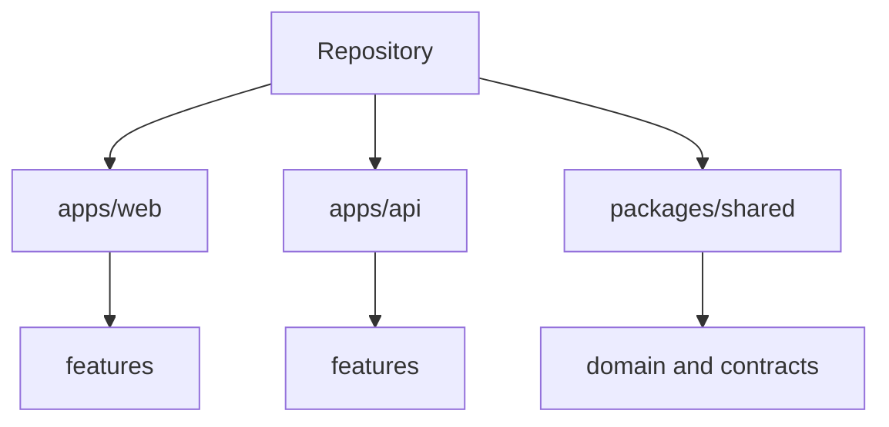

## adr_003_code_organization - Code Organization
> Date: 2026-07-13
> Status: Accepted
> Related request: `req_011_define_cr_league_engineering_adrs`
> Related backlog: `item_017_define_cr_league_engineering_adrs`
> Related task: `task_012_define_cr_league_engineering_adrs`
> Drivers: modularity, readable feature ownership, small files, testable domain logic
> Reminder: Update status, linked refs, decision rationale, consequences, and follow-up work when you edit this doc.

# Overview Diagram


# Decision
Organize code by product/domain features and keep files small.

Target shape:

```txt
apps/web/src/
  app/
  features/
    race/
    team/
    league/
    inventory/
  ui/
  lib/

apps/api/src/
  app.ts
  server.ts
  config.ts
  db/
  features/
    health/
    solo/
    races/
    teams/
  simulation/

packages/shared/src/
  domain/
  contracts/
  cards/
  simulation/
```

# Rules
- No god files.
- Aim to split files once they exceed roughly 250-300 lines.
- React components above roughly 200 lines are suspect and should be split or have logic extracted.
- Keep business logic out of React components.
- Keep API route handlers thin; move rules into feature/domain modules.
- Avoid `utils.ts` catch-all files.
- Avoid barrel exports when they hide dependencies or create cycles.
- Shared package should not import from `apps/*`.
- API can import from shared; web can import from shared.

# Rationale
- The game will grow across simulation, cards, reports, replay, leagues, and inventory.
- Feature-oriented folders keep related behavior close without turning technical folders into dumping grounds.
- Small files reduce review cost and prevent accidental coupling.

# Non-goals
- No abstract architecture framework.
- No generated module boundaries.
- No repository-wide file-size linter yet.
- No premature plugin system.

# Revisit Triggers
- Feature folders become circular or hard to test.
- Shared package starts accumulating server-only or UI-only logic.
- File-size drift becomes common enough to enforce automatically.
