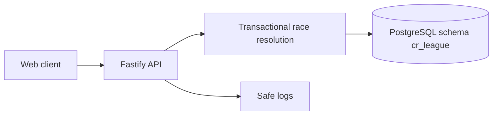

## adr_004_data_security - Data and Security
> Date: 2026-07-13
> Status: Accepted
> Related request: `req_011_define_cr_league_engineering_adrs`
> Related backlog: `item_017_define_cr_league_engineering_adrs`
> Related task: `task_012_define_cr_league_engineering_adrs`
> Related spec: `spec_010_data_model_and_api_contract_v0`
> Drivers: server authority, idempotent race resolution, Postgres schema isolation, secret hygiene
> Reminder: Update status, linked refs, decision rationale, consequences, and follow-up work when you edit this doc.

# Overview Diagram


# Decision
Use the API as the authoritative trust boundary for game state.

Use PostgreSQL through Prisma with a dedicated schema:

```txt
schema=cr_league
```

# Rules
- Never trust the client for credits, cards, race results, or standings.
- Invite codes are not authentication by themselves.
- Race resolution must be idempotent.
- Use database uniqueness and transactions for duplicate prevention where correctness matters.
- Do not use `schema=public`.
- Never commit `.env`, production database URLs, tokens, or secrets.
- Treat all `VITE_*` variables as public.
- Backend secrets belong only in runtime environment variables.
- Logs must not include secrets, bearer tokens, production URLs with credentials, or full personal data exports.

# Race Resolution Requirements
- If a race is already resolved, return the stored result.
- A race can produce only one `RaceResult`.
- Card consumption must happen once.
- Credit and standings updates must happen once.
- Missing player decisions are filled server-side.

# Rationale
- CR League's economy and race results are game authority surfaces.
- The frontend should be convenient, not trusted.
- Idempotency avoids duplicate rewards when sleeping hosts wake or multiple users open the same race.

# Non-goals
- No full auth platform before private multiplayer needs it.
- No payment/security compliance posture in V1.
- No encryption scheme for ordinary game state.
- No queue/worker for race resolution in V1.

# Revisit Triggers
- Real private multiplayer requires stronger identity.
- Race resolution concurrency cannot be handled cleanly through API transactions.
- Production deployment introduces new secret surfaces.
