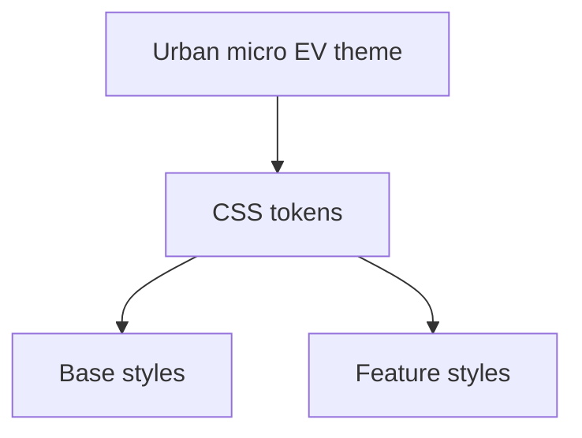

## adr_005_theme_design_system - Theme and Design System
> Date: 2026-07-13
> Status: Accepted
> Related request: `req_011_define_cr_league_engineering_adrs`
> Related backlog: `item_017_define_cr_league_engineering_adrs`
> Related task: `task_012_define_cr_league_engineering_adrs`
> Related spec: `spec_014_theme_and_brand_inspiration`
> Drivers: urban micro-EV identity, mobile-first UX, low UI dependency cost, consistent styling
> Reminder: Update status, linked refs, decision rationale, consequences, and follow-up work when you edit this doc.

# Overview Diagram


# Decision
Start with plain CSS and CSS custom properties.

Do not add a UI framework or Tailwind in the first implementation wave.

Initial style shape:

```txt
apps/web/src/styles/
  tokens.css
  base.css
  layout.css
```

# Theme Direction
Use a fictional urban micro-EV racing identity:

- compact electric vehicles;
- city circuits;
- battery, route, weather, and agility vocabulary;
- competitive but not serious F1;
- playful but not childish;
- lightly retro, modern city energy.

# Rules
- Define colors, spacing, radii, typography, and elevation as CSS variables before broad reuse.
- Keep cards at modest radius unless a component specifically needs otherwise.
- Avoid UI cards inside other UI cards.
- Avoid one-note palettes dominated by a single hue.
- Avoid decorative gradient orbs/blobs.
- Prefer responsive layouts over separate component forks.
- Add reusable components only after real duplication appears.

# Rationale
- The product needs a strong theme but not a heavy design system yet.
- Plain CSS keeps the first slice easy to inspect and adjust.
- Theme choices should serve gameplay readability first.

# Non-goals
- No full design system package in V1.
- No component library dependency until native components fail.
- No final logo/brand system yet.
- No 3D requirement.

# Revisit Triggers
- Repeated UI duplication creates maintenance cost.
- Accessibility or interaction patterns benefit from a proven component library.
- Visual production needs outgrow plain CSS structure.
