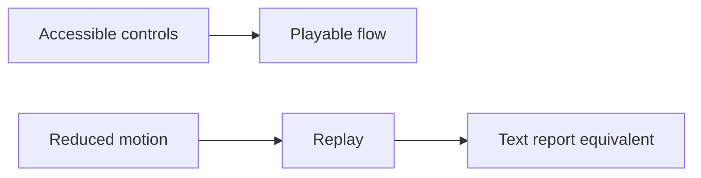

## adr_006_accessibility - Accessibility
> Date: 2026-07-13
> Status: Accepted
> Related request: `req_011_define_cr_league_engineering_adrs`
> Related backlog: `item_017_define_cr_league_engineering_adrs`
> Related task: `task_012_define_cr_league_engineering_adrs`
> Related spec: `spec_015_device_targets_and_responsive_ux`
> Drivers: mobile-first play, replay explainability, keyboard access, reduced motion
> Reminder: Update status, linked refs, decision rationale, consequences, and follow-up work when you edit this doc.

# Overview Diagram

# Decision
Accessibility is part of V1 implementation, not a post-release polish task.

The replay must never be the only source of race information; the text report is the accessible source of truth.

# Rules
- No hover-only interactions.
- All interactive controls must be keyboard reachable.
- Focus states must be visible.
- Touch targets should be at least 44px where practical.
- Text must fit in buttons/cards on mobile and desktop.
- Color must not be the only indicator of card status, weather state, or race outcome.
- Respect `prefers-reduced-motion`.
- Replay must be skippable.
- Replay events must have text equivalents in the report.
- Forms must use labels or accessible names.
- Use semantic buttons for actions.

# Rationale
- Mobile casual play requires clear touch ergonomics.
- The race is simulated, so explanation must remain available without animation.
- Accessibility constraints also improve general usability.

# Non-goals
- No complete WCAG audit before first prototype.
- No screen-reader-specific custom mode.
- No automated a11y gate until UI exists.

# Revisit Triggers
- The replay becomes central enough to require richer alternate descriptions.
- Playtesters struggle with motion, contrast, or controls.
- UI complexity grows enough to justify automated accessibility checks.
