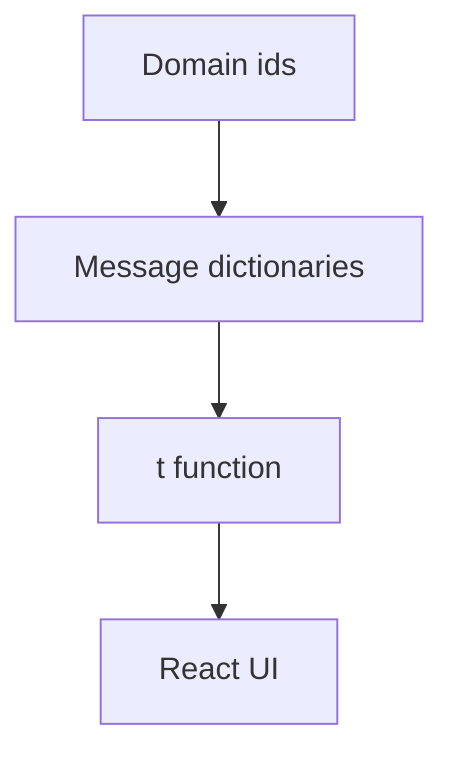

## adr_007_i18n - Internationalization
> Date: 2026-07-13
> Status: Accepted
> Related request: `req_011_define_cr_league_engineering_adrs`
> Related backlog: `item_017_define_cr_league_engineering_adrs`
> Related task: `task_012_define_cr_league_engineering_adrs`
> Drivers: likely French early players, English technical docs, future translation readiness
> Reminder: Update status, linked refs, decision rationale, consequences, and follow-up work when you edit this doc.

# Overview Diagram


# Decision
Use English as the source language for code identifiers, technical docs, and initial message keys.

Prepare app UI for French without adding an i18n dependency in the first slice.

Initial shape:

```txt
apps/web/src/i18n/
  messages.en.ts
  messages.fr.ts
  t.ts
```

# Rules
- Do not scatter substantial user-facing copy across many components once real UI screens are built.
- Use stable message keys, not raw English strings as lookup ids.
- Keep short dev logs and internal errors in English.
- Use `Intl.DateTimeFormat` and `Intl.NumberFormat` before adding a library.
- Add an i18n library only when pluralization, interpolation, routing, or runtime switching becomes painful.
- Card ids and domain enum values stay language-neutral.

# Rationale
- Early users are likely francophone, but project code and docs are already in English.
- A tiny dictionary approach is enough for the first vertical slice.
- Avoiding a library now keeps the scaffold light.

# Non-goals
- No full locale routing in V1.
- No translation management platform.
- No runtime language selector until there is real translated UI.
- No backend-localized reports until report templates stabilize.

# Revisit Triggers
- French UI becomes mandatory for playtest.
- Reports/cards require pluralization and richer interpolation.
- Multiple locales beyond English/French become likely.
