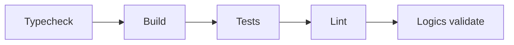

## adr_008_testing_quality - Testing and Quality
> Date: 2026-07-13
> Status: Proposed
> Related request: `req_011_define_cr_league_engineering_adrs`
> Related backlog: `item_017_define_cr_league_engineering_adrs`
> Related task: `task_012_define_cr_league_engineering_adrs`
> Drivers: deterministic simulation, small gates, useful tests, local confidence
> Reminder: Update status, linked refs, decision rationale, consequences, and follow-up work when you edit this doc.

# Overview Diagram


# Decision
Use small, targeted validation gates.

Default local gate:

```bash
npm run typecheck
npm run build
npm test
npm run lint
npm run logics:validate
```

# Testing Strategy
- Shared simulation: strong deterministic unit tests with fixed seeds.
- API: Fastify inject tests for route behavior and idempotency.
- Web: component tests for critical flows once UI exists.
- End-to-end: add Playwright only after the vertical slice exists.
- Logics: run lint/audit for workflow docs.

# Rules
- Every non-trivial pure algorithm needs at least one focused test.
- Race simulation must have deterministic seed tests.
- Race resolution must test duplicate resolve/idempotency once API persistence exists.
- Avoid broad snapshot tests unless they catch real regressions.
- Do not test implementation details that make refactors expensive.
- Keep test data small and readable.

# Rationale
- The game core depends on deterministic simulation and explainable results.
- Heavy test infrastructure before gameplay exists would slow iteration.
- Small tests around core rules give better value than broad brittle snapshots.

# Non-goals
- No mandatory Playwright before real flows exist.
- No coverage threshold in early V1.
- No visual regression system yet.
- No CI design in this ADR; local gates come first.

# Revisit Triggers
- UI flows become stable enough for e2e smoke tests.
- Simulation bugs escape unit tests.
- Deployment begins and CI becomes required.
