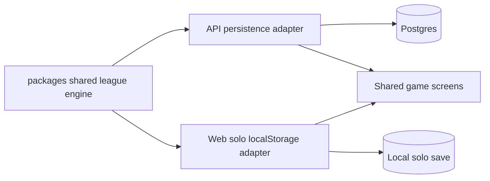

## adr_009_shared_local_and_network_league_engine - Shared local and network league engine
> Date: 2026-07-28
> Status: Proposed
> Related request: `req_131_solo_and_multiplayer_entry_split_with_local_solo_mode`
> Related backlog: `item_348_build_local_solo_state_persistence_and_action_adapter`
> Related task: `task_132_orchestrate_solo_multiplayer_entry_and_local_solo_mode`
> Related product: `prod_083_solo_multiplayer_entry_and_local_solo_mode_product_brief`
> Drivers: no duplicated engine, local solo without API, multiplayer parity, browser-compatible shared domain, isolated persistence adapters
> Reminder: Update status, linked refs, decision rationale, consequences, and follow-up work when you edit this doc.

# Overview
Solo and multiplayer must use one mutable league engine. The API path should persist league state through the database, while the solo path should persist the same state shape through localStorage. Both paths should call shared domain functions in `packages/shared` for gameplay state transitions.

# Overview Diagram

# Context
- The current web action layer sends multiplayer mutations to the API for decisions, qualifying, race resolution, next Grand Prix, garage purchases, card sales, livery updates, and team rename.
- Solo V1 must run without API calls after the app is loaded, but it must still feel like the same CR League game and reuse Drive, Plan, Garage, Championship, Replay, and Report surfaces.
- The shared `LeagueState` type already represents league metadata, current Grand Prix, history, teams, card shop, action state, player claim, and decisions.
- Duplicating race, garage, and team mutation logic in the web app would create drift between solo and multiplayer behavior.
- The confirmed product scope is one local solo save slot, no cloud sync, no invite code, no profile requirement for Solo, and no PWA/offline packaging requirement in this slice.

# Decision
- Extract or create shared domain modules under `packages/shared/src/domain/`:
  - `leagueFactory.ts` creates initial LeagueState instances for solo and API-backed league creation from explicit inputs.
  - `leagueEngine.ts` owns deterministic LeagueState transitions.
- The shared engine should expose operations for at least:
  - `createLeagueState`
  - `submitDecision`
  - `runQualifying`
  - `resolveGrandPrix`
  - `startNextGrandPrix`
  - `buyCard`
  - `sellCard`
  - `updateLivery`
  - `updateTeamName`
- API-backed multiplayer should load DB records, map them into the shared engine input/state as needed, call the shared engine, then persist the resulting state back to the database.
- Web local solo should load the versioned local save, call the same shared engine, update React state, and persist the updated save back to localStorage.
- The web app may have a small mode/action boundary, but it should only choose persistence transport: API for multiplayer, localStorage for solo. It should not own duplicate gameplay rules.
- Solo persistence should use a dedicated versioned key, recommended `cr-league-solo-save-v1`, storing LeagueState plus schemaVersion, createdAt, and updatedAt metadata.

# Consequences
- Multiplayer refactoring should happen before solo action wiring so existing API behavior can be regression-tested against the shared engine.
- Shared domain code must stay browser-compatible: no Prisma, Fastify, Node-only APIs, or direct localStorage access inside `packages/shared`.
- API modules remain responsible for authorization, claim validation, rate limits, DB transactions, and HTTP error mapping.
- Web solo modules remain responsible for local save load/save, local reset confirmation, and no-fetch tests.
- Some DB-to-LeagueState mapping may remain in the API layer if the persistent schema does not match the shared state shape exactly.
- The implementation can be delivered in three waves: shared engine extraction, entry/storage, then solo action wiring and no-fetch proof.

# Rejected alternatives
- Duplicate local solo mutations in `apps/web`: fastest initially, but likely to drift from multiplayer race and economy behavior.
- Add local-mode API endpoints: keeps web thin but violates the no-API solo requirement.
- Full PWA/offline app: useful later, but not required for V1 and would expand the scope beyond gameplay mode separation.

# References
- Related request: `req_131_solo_and_multiplayer_entry_split_with_local_solo_mode`
- Related backlog: `item_348_build_local_solo_state_persistence_and_action_adapter`
- Related task: `task_132_orchestrate_solo_multiplayer_entry_and_local_solo_mode`
- Related product: `prod_083_solo_multiplayer_entry_and_local_solo_mode_product_brief`
