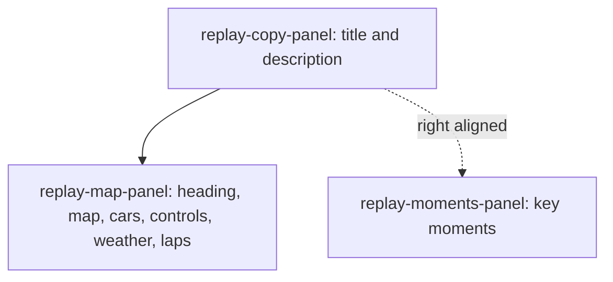

## adr_010_replay_layout_zone_ownership - Replay layout zone ownership
> Date: 2026-07-29
> Status: Accepted
> Related request: `req_132_pop_driver_reaction_emotes_above_cars_during_the_replay`
> Related backlog: `item_352_render_the_emote_above_every_car_on_the_replay_map`
> Related task: `task_133_orchestrate_race_replay_driver_emotes`
> Related product: `prod_084_race_replay_driver_emotes_product_brief`
> Drivers: unambiguous panel ownership, reviewable layout changes, desktop and mobile parity, contract enforced by an executable test
> Reminder: Update status, linked refs, decision rationale, consequences, and follow-up work when you edit this doc.

# Overview
The Replay view is split into three named zones, each owning a defined set of elements. Naming
ownership rather than position is what makes a layout change reviewable: a diff can be read
against the contract instead of against a screenshot.

Migrated from `docs/adr/0001-result-replay-layout.md`, which sat outside the Logics corpus and
was referenced by nothing.

# Overview Diagram

# Context
- Replay layout changes were ambiguous because panel names described appearance rather than
  which elements each panel owned.
- The replay is the densest screen in the app: it carries the circuit map, car sprites, position
  deltas, playback controls, the plan panel, the classification and the race director banner.
- Without an ownership contract, an element could migrate between panels in a refactor and no
  review step would catch it.

# Decision
- The Replay view has exactly three named zones:
  - `replay-copy-panel` owns the "Race replay" title and description.
  - `replay-map-panel` owns the circuit heading, map, cars, playback controls, weather timeline
    and lap markers.
  - `replay-moments-panel` owns key moments.
- Desktop layout: `replay-copy-panel` is left/top, `replay-map-panel` sits below it, and
  `replay-moments-panel` is right aligned with `replay-copy-panel`.
- Mobile layout: the zones stack as copy, then map, then moments.
- The contract is enforced by an executable test rather than by convention.

# Consequences
- New replay elements must be assigned to one of the three zones; adding a fourth panel is an
  ADR change, not an implementation detail.
- `tests/e2e/private-league.spec.ts` holds the layout contract test, which checks DOM ownership,
  desktop positioning and mobile stacking, and writes desktop/mobile screenshots to the
  Playwright output.
- Overlay work that floats above the map, such as position deltas and future per-car indicators,
  belongs to `replay-map-panel` because that zone owns the cars.

# Rejected alternatives
- Describe the layout by position only: reads well in a mockup but gives a reviewer nothing to
  check a refactor against.
- Leave the contract implicit in CSS: the rules exist but nothing fails when an element moves to
  the wrong panel.

# References
- Related request: `req_132_pop_driver_reaction_emotes_above_cars_during_the_replay`
- Related backlog: `item_352_render_the_emote_above_every_car_on_the_replay_map`
- Related task: `task_133_orchestrate_race_replay_driver_emotes`
- Implementation: `apps/web/src/features/ReplayView.tsx`
- Contract test: `tests/e2e/private-league.spec.ts`
- Responsive rules: `apps/web/src/styles/responsive.css`
