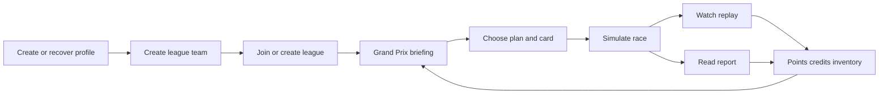

## prod_001_cr_league_product_brief - CR League Product Brief
> Date: 2026-07-13
> Status: Settled
> Related request: `req_023_add_automated_private_league_playtest_scenario`
> Related backlog: `item_029_add_automated_private_league_playtest_scenario`
> Related task: `task_024_add_automated_private_league_playtest_scenario`
> Related architecture: (none yet)
> Reminder: Update status, linked refs, scope, decisions, success signals, and open questions when you edit this doc.
> Confidence: 80
> Non-semantic edit: clarified lightweight profile recovery within the settled product scope without changing workflow links or status.

# Overview
CR League is an asynchronous racing championship game where players manage a team, make a few strategic pre-race bets, play special cards, then watch a simulated Grand Prix produce a visual replay, report, rewards, and championship movement.

Short pitch:

> A private racing league game where you do not drive. You run a team, prepare each Grand Prix, play one special move, then watch the race replay reveal whether your plan was genius or a disaster.

The product should feel like a social strategy game wrapped in a racing championship. The player is a team principal, not a driver. The core pleasure is reading a pre-race briefing, making a small number of meaningful decisions, committing to a risk, and then getting a clear race story back.

The first playable version must prove one question before anything else:

> Does choosing a few pre-race directives create enough tension, understanding, and social story to make players want to come back for the next Grand Prix?

# Overview diagram

# Goals
- Make each Grand Prix feel like a short strategic bet rather than a driving challenge: players read the conditions, commit to a plan, optionally play a card, and then see whether the plan paid off.
- Create a game that works for private social leagues first, while still allowing immediate solo play with bots for onboarding, testing, and players who want to play at their own pace.
- Generate race stories that players can understand and retell: weather gambles, rival battles, card saves, mechanical failures, late comebacks, and visible consequences of pre-race choices.
- Keep the first version approachable for non-gamers by limiting mandatory pre-race decisions, providing strong defaults, and avoiding excessive configuration.
- Give engaged players more to think about through optional practice insights, card inventory planning, rival goals, and risk/reward tradeoffs without forcing casual players through heavy management screens.
- Use a cheap, robust asynchronous architecture: races can be scheduled, but simulation may happen lazily when the league is next accessed after the deadline.

# Target audience
- Primary emotional target: private leagues between friends or coworkers. Players should be able to create a league, share a short invite code, and get a shared championship running without needing gaming expertise.
- Secondary target: solo players who want to play immediately against bots, learn the game, test strategies, and accelerate time.
- Skill range: broad public audience. The game must be approachable for casual players but should expose optional depth for players who want to optimize.
- Session shape: a casual player should be able to prepare a Grand Prix in about two minutes. A more engaged player should be able to spend longer reviewing practice hints, inventory, rivals, and risk.

# Product pillars
- Team principal, not driver: the player acts before the race. They set the plan, then watch the consequences.
- Each Grand Prix is a bet: the player reads uncertain conditions and chooses where to take risk.
- Results must be explainable: the race cannot feel like a black box. Replay and report must show why important outcomes happened.
- Social league first: the game should create stories players can retell in chat or at work.
- Comeback without fake wins: trailing players receive options, goals, and risk tools, but the simulation must not secretly hand them victories.
- Strong defaults over configuration overload: league setup must be fast, with limited settings exposed in V1.
- Cheap asynchronous operation: V1 should not rely on always-on live infrastructure.

# Game modes
## Profile and team identity
- The first app action is lightweight profile setup: the player enters an email and receives a recovery code they can keep to recover the account reference on another device.
- The profile is not the racing identity shown inside championships. Each league stores its own team name and colors, so the same profile can run different teams across solo and private leagues.
- Team names should stay short and readable: 3 to 32 characters, letters/numbers/spaces plus simple apostrophe or hyphen punctuation. League names should stay within 3 to 40 readable characters.
- League and team creation should use strong random defaults so creating a first session does not feel like filling empty admin inputs.

## Solo
- The player creates a team and starts a championship with bots.
- Solo races can be launched immediately without waiting for real time.
- Solo uses the same race engine, card system, rewards, and standings logic as multiplayer.
- Solo is useful for onboarding, experimentation, and players who want a faster cadence.

## Private multiplayer league
- A player creates a private league and shares a short invite code, for example six characters.
- Human players can join before the season starts or before a configurable lock point.
- Bots can fill empty slots so the championship still feels populated.
- The default cadence is weekly, but cadence should be configurable.
- If a player misses the preparation deadline, the race still proceeds with a default plan.
- League creation can expose only a few setup levers: max players, bot fill, qualifying attempt limit, and GP per season. These settings are useful for playtests but should stay compact.

# Default V1 assumptions
- Season length: 6 Grand Prix by default, configurable up to 18 in the current prototype; expose a 3-GP playtest preset and a 6-GP season preset before adding more setup options.
- Participants: 2 to 8 human players by default, configurable up to 16, with bots available to fill the grid.
- Race cadence: weekly by default for multiplayer; manual immediate launch for solo.
- Pre-race mandatory decisions: 3 decisions by default.
- Qualifying attempts: 3 by default, configurable up to 5.
- Cards: mostly consumable in V1.
- Card usage: maximum 1 played card per Grand Prix.
- Race presentation: visual top-down 2D replay plus written race report.
- Backend timing: lazy race resolution is acceptable.

These are defaults, not final balance laws. The engine can remain parameterized internally, but the user-facing setup must stay simple.

# Grand Prix loop
## 1. Briefing
The player sees the upcoming race context:

- circuit identity and traits, such as fast, technical, urban, high wear, or weather-sensitive;
- weather forecast expressed as probabilities, not certainty;
- current team state, such as confidence, reliability, or recent form if those exist in the current build;
- current standings and nearby rivals;
- available cards and credits;
- optional practice or scouting hints for players who want deeper preparation.

The briefing should help players make a risk decision. It should not present raw simulation formulas.

## 2. Qualifying
Before locking the race directive, the player can run a limited number of qualifying attempts using the current directive and expected conditions.

- Best qualifying time helps determine the starting grid.
- The player can replay the latest qualifying attempt.
- Bots should run at least one qualifying attempt before the GP starts.
- Once the race directive is locked, qualifying is closed for that GP.

Qualifying should create useful pressure before the GP without becoming a separate driving game.

## 3. Preparation
The V1 preparation model should use three decisions:

- Race approach: prudent, balanced, or aggressive.
- Technical preparation: speed, reliability, or weather adaptation.
- Special plan: play one card, target a rival objective, or choose no special move.

The exact labels may change, but the structure should remain small. The player should feel they are choosing a plan, not filling a spreadsheet.

## 4. Lock or launch
- In solo, the player can launch the Grand Prix immediately.
- In multiplayer, the race resolves after a deadline or when the configured condition is met.
- Missing players receive default choices so the league does not stall.

## 5. Simulation
The race engine combines:

- team/player choices;
- qualifying grid;
- bot profiles;
- circuit traits;
- weather outcome;
- risk and reliability;
- card effects;
- current standings and rival context where relevant;
- a stored seed for reproducibility.

The simulation should produce both final results and an event timeline.

## 6. Replay
The replay should be short, readable, and focused on drama rather than realism:

- top-down 2D circuit view;
- identifiable cars or teams;
- visible weather state;
- position changes and major events;
- card triggers and mechanical moments shown as simple event cues;
- short duration, likely 30 to 60 seconds for V1.

The replay does not need direct interaction in V1.

## 7. Race report
The written report explains what happened:

- final classification;
- championship points and standings movement;
- credits gained;
- key race events;
- which player decisions mattered;
- card impact;
- rival outcome;
- why a strategy succeeded or failed when there is a clear reason.

The report should create social quotes, such as:

- "Your rain gamble paid off when showers arrived mid-race."
- "The aggressive start gained two places, but increased late reliability pressure."
- "Fleet Maintenance prevented a minor failure from becoming a retirement."
- "You finished ahead of your rival for the first time this season."

## 8. Progression
After the race:

- standings update;
- credits are awarded;
- used consumable cards are removed;
- the garage/shop becomes relevant;
- the next Grand Prix briefing becomes the next reason to return.
- at season rollover, standings restart for the new season while prior GP history remains consultable.

# Cards and inventory
Cards are special tactical moves. They should feel closer to accessible board-game events than to a deep deckbuilder.

Current prototype card rules:

- 15 cards in the current catalogue;
- all current cards are consumable;
- one played card maximum per Grand Prix;
- stored in a simple team inventory;
- bought with race credits through a simple shop;
- optionally sold back later if needed, but resale is not mandatory for the earliest prototype.

Good cards should create race stories. Avoid cards that are only invisible stat modifiers.

Example V1 card directions:

- Rain Grip: strong upside if rain appears, downside if the race stays dry.
- Fleet Maintenance: cancels the first minor reliability failure.
- Launch Boost: gains early position when paired with aggressive approach, but increases wear risk.
- Defensive Order: reduces driver error risk while defending.
- Final Surge: improves final-lap pace if outside the podium, with reliability risk.
- Urban Draft: bonus when running behind a target rival.
- Defensive Order: protects points with lower upside.
- Fleet Sponsorship: sacrifices performance potential for extra credits.
- Qualifying-focused cards can improve a chrono attempt, but only those chrono cards should lock the card choice after qualifying.

# Economy and progression
V1 should keep resources minimal:

- Championship points: sporting success and season ranking.
- Credits: earned after races and used to buy cards.
- Inventory: cards owned by the team.

Avoid deep garage management in V1. No staff hiring, complex car parts, sponsor contracts, or permanent upgrade trees until the core loop is proven.

The current garage may cover team identity, livery colors, car preview, inventory/shop, and card purchase confirmation. That is still "light garage" as long as it does not introduce permanent stat upgrades.

Rewards should encourage return:

- all players earn something after each race;
- strong results earn meaningful rewards;
- trailing players may receive slightly better opportunity access, such as extra credits or cards that work well from behind;
- players should always have a next-race plan to consider.

# Balancing and retention
The game should not make the leader unbeatable, and it should not punish the leader so hard that winning feels pointless.

Acceptable comeback mechanisms:

- trailing players earn a modest credit opportunity;
- some cards are more useful when behind or outside podium positions;
- risky strategies allow major gains but carry real downside;
- rival goals give non-leaders meaningful objectives;
- weather uncertainty creates fair volatility because players see probabilities before deciding.

Avoid:

- hidden race manipulation to force close standings;
- guaranteed comeback cards;
- pure random upsets that cannot be understood after the fact;
- visible "loser bonus" language that embarrasses or patronizes players.

# Rivals
Rivalries are important for social leagues because not every player can fight for first place every race.

The game can assign or suggest rivals based on:

- nearby championship position;
- last-race conflict;
- repeated close finishes;
- a bot or human that is currently blocking progress.

Rival goals can create local wins:

- finish ahead of your rival;
- close the points gap;
- pressure a rival into an error;
- defend against a rival attack.

This makes 5th place more interesting because the player may still have a clear race objective.

# Bots
Bots should not be anonymous fillers. They need simple, legible personalities.

Possible bot archetypes:

- The Prudent: avoids risk, scores consistently.
- The Gambler: often chooses aggressive plans and volatile cards.
- The Rain Specialist: performs well under uncertain weather.
- The Mechanic: prioritizes reliability.
- The Sprinter: strong starts, weaker long-run consistency.
- The Opportunist: targets rivals and late-race moves.

Bots do not require complex AI in V1. They need predictable tendencies that create readable opponents and useful solo practice.

# Art direction
Desired direction:

- competitive cartoon;
- slightly retro;
- readable top-down racing;
- stylish but not childish;
- playful but not ridiculous;
- not futuristic or strange sci-fi;
- not a serious motorsport simulation.

The game should feel like a modern digital board game crossed with arcade motorsport management. Colors can be bold, but the UI should remain clear. Cars and teams should be instantly identifiable in the replay.

V1 should start with 2D top-down presentation. 3D can be explored later only after the gameplay loop is proven.

# Technical assumptions
- Web app.
- Persistent backend storage for profiles, teams, leagues, schedules, decisions, race seeds, race results, event timelines, inventory, credits, and standings.
- Profile recovery is intentionally lightweight in the prototype: unique email plus recovery code, stored locally after setup. It is a sync/recovery bridge, not full password or OAuth authentication.
- Minimal backend suitable for low-cost hosting.
- Lazy scheduled race resolution: if a multiplayer Grand Prix is due at 20:00 and nobody accesses the league until 21:10, the first access resolves and stores the result.
- Race resolution must be idempotent so two users opening the league at the same time cannot create duplicate results.
- Simulation should be seedable and reproducible for debugging.
- Solo and multiplayer should share the same simulation engine.
- No hard dependency on real-time networking in V1.

# MVP scope
The MVP should prove the loop, not the whole long-term game.

Must have:

- create a team;
- create a solo league with bots;
- create a private multiplayer league;
- join a league with a short invite code;
- generate a season calendar;
- show the next Grand Prix briefing;
- collect the three core pre-race decisions;
- allow one card to be played;
- simulate the race;
- show a top-down 2D replay;
- show an explanatory race report;
- update standings;
- award credits;
- maintain a simple card inventory;
- provide a simple card shop or reward mechanism;
- proceed when multiplayer users miss deadlines through default decisions.

Can wait until later:

- richer cosmetics;
- public leagues;
- notifications;
- advanced practice sessions;
- permanent upgrades;
- card rarity and crafting;
- player-to-player trading;
- 3D presentation;
- mobile app packaging.

# Non-goals
- Do not build real-time driving or direct in-race player control in V1.
- Do not require a constantly awake backend process to trigger races exactly on schedule in V1.
- Do not build a deep Formula 1-style management simulation with staff, engineering departments, contracts, sponsors, and complex car parts in V1.
- Do not build a large deckbuilder or complex trading-card economy in V1.
- Do not make advanced 3D presentation a dependency for proving the game loop.
- Do not expose many league and simulation parameters to users during initial league creation.

# Success signals
- A casual player understands what to do before a Grand Prix without reading external instructions.
- After a race, the player can explain at least one reason the result happened.
- A private league can complete races even when some players do not prepare manually.
- A trailing player still has a meaningful objective and a plausible comeback path.
- A solo player can run multiple races quickly using the same loop as multiplayer.
- The first prototype produces at least one memorable race story per Grand Prix, such as a weather gamble, card save, rival overtake, late failure, or comeback.

# Key risks
- Black-box simulation: players may feel outcomes are random if reports and replay do not explain causality.
- Slow multiplayer rhythm: weekly leagues can stall if deadlines, defaults, and return hooks are weak.
- Too much configurability: league setup can become intimidating if V1 exposes too many parameters.
- Card balance: cards can become either irrelevant or unfair if their triggers and downsides are unclear.
- Visual scope creep: 3D or asset production can consume effort before the game is fun.
- Split solo and multiplayer needs: solo wants speed, multiplayer wants suspense. The shared engine must support both cadences.
- Over-management: too many resources, upgrades, and stats would bury the simple strategic bet at the heart of the game.

# Deferred Decisions
- Keep fixed card offers until playtest evidence shows the shop is too flat or too predictable; then try draft or hybrid offers before deeper card systems.
- Use partial season credit carry-over with a cap as the first continuity mechanic; champion rewards should be cosmetic only.
- Default multiplayer cadence should resolve when all players are ready, otherwise at the deadline; missing plans use a neutral visible default.
- Keep car wear or team condition out until playtesters say seasons lack continuity even after rollover economy.
- Keep 2D replay as the presentation baseline; improve callouts/animation before considering 3D.
- If qualifying makes race outcomes too deterministic, soften grid advantage or increase overtaking windows before redesigning qualifying.
- Keep admin accident recovery operational first: confirmations, support runbooks, and test-data cleanup before undo tooling.

# Open questions
- Does the current qualifying model make the starting grid feel earned without making the final race feel predetermined?
- What replay fidelity is enough before live beta?

# References
- Product back-reference: `item_029_add_automated_private_league_playtest_scenario`
- Task back-reference: `task_024_add_automated_private_league_playtest_scenario`
