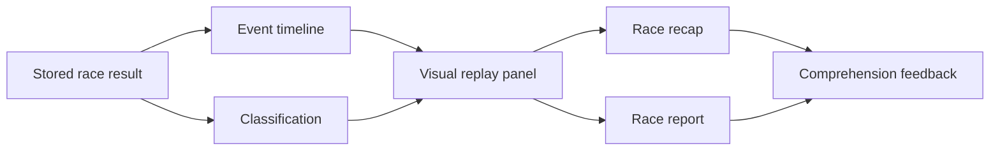

## prod_002_visual_replay_v0_product_brief - Visual Replay V0 Product Brief
> Date: 2026-07-14
> Status: Proposed
> Related request: `req_031_add_first_visual_race_replay_from_event_timeline`
> Related backlog: `item_037_design_visual_replay_v0_contract_and_layout`, `item_038_implement_visual_replay_panel_in_the_web_app`, `item_039_capture_replay_v0_playtest_prompts_and_follow_up_risks`
> Related task: `task_032_orchestrate_visual_replay_v0`
> Related architecture: (none yet)
> Reminder: Update status, linked refs, scope, decisions, success signals, and open questions when you edit this doc.

# Overview
Visual Replay V0 turns the stored event timeline into a small top-down race replay panel that makes a resolved Grand Prix feel observable, causal, and more immersive without requiring a full race engine.

# Overview diagram

# Goals
- Make the first few seconds after resolving a Grand Prix feel like watching a race outcome, not only reading a table.
- Show a compact top-down track or lane metaphor that communicates progression, player team presence, and key moments.
- Reinforce the existing race recap by visually pointing to events that already explain why the result happened.
- Stay cheap and maintainable: use existing event/result data, React, semantic HTML, SVG or CSS, and deterministic rendering.
- Validate whether a simple visual layer improves playtest comprehension before investing in animation-heavy replay or 3D.

# Non-goals
- Do not implement live racing, physics, collision, or real-time multiplayer viewing.
- Do not add Three.js, Pixi, Canvas game loops, or generated art assets in this slice.
- Do not change simulation balance or event generation rules unless a tiny display-only field is truly required.
- Do not remove the text replay, race report, or recap; the visual replay should complement them.
- Do not build a full broadcast mode, replay controls timeline editor, or cinematic sequence.

# Scope and guardrails
- In: a compact replay panel on resolved Grand Prix screens, rendered from existing classification and event data.
- In: player marker, field or rival marker, winner/result context, lap progression, and key event callouts.
- In: desktop and mobile readability, EN/FR copy, unit/e2e coverage, visual screenshots, and playtest prompt updates.
- Out: live racing, physics, new simulation balance, full animation system, generated assets, Canvas game loop, Three.js, Pixi, and new backend endpoints.

# Key product decisions
- Start with a static or very lightly animated replay metaphor before investing in richer replay technology.
- Treat existing `RaceResult` data as the source of truth: classification and events should drive the panel.
- Keep the text recap, key-moments list, and race report because the visual panel is an aid, not the full explanation.
- Prefer boring React, semantic HTML, SVG, and CSS over a rendering dependency in V0.

# Success signals
- A tester can identify the player team, winner, and at least one key moment faster than from the text-only timeline.
- Desktop and mobile screenshots show readable labels with no overlap.
- The e2e 3-GP flow still passes and asserts that the visual replay appears after GP resolution.
- Playtest notes can answer whether V0 is enough or whether richer animation is worth a later slice.

# References
- Product back-reference: `req_031_add_first_visual_race_replay_from_event_timeline`
- Task back-reference: `task_032_orchestrate_visual_replay_v0`
