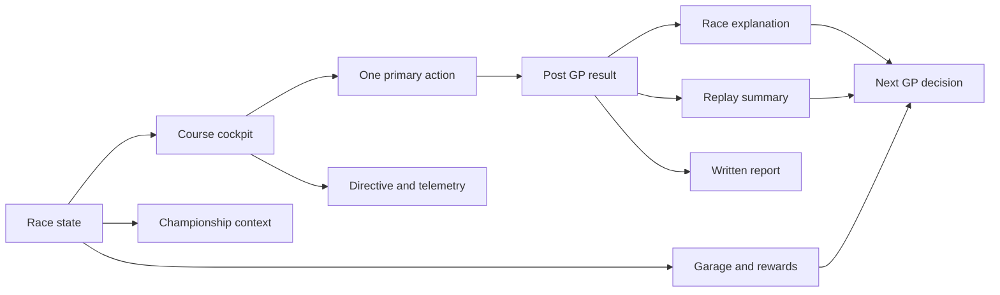

## prod_003_race_cockpit_redesign_v0_product_brief - Race Cockpit Redesign V0 Product Brief
> Date: 2026-07-14
> Status: Proposed
> Related request: `req_032_redesign_the_cr_league_race_cockpit_v0`
> Related backlog: `item_040_define_the_cockpit_information_architecture`, `item_041_establish_visual_direction_and_css_foundations`, `item_042_rebuild_the_race_desk_around_one_clear_action`, `item_043_redesign_championship_and_garage_as_supporting_panels`, `item_044_make_result_and_replay_presentation_unambiguous`, `item_045_audit_and_harden_i18n_for_redesigned_surfaces`, `item_046_split_the_web_cockpit_into_practical_components`, `item_047_validate_the_redesigned_cockpit_with_screenshots_and_playtest_prompts`
> Related task: `task_033_orchestrate_race_cockpit_redesign_v0`
> Related architecture: (none yet)
> Reminder: Update status, linked refs, scope, decisions, success signals, and open questions when you edit this doc.
> Non-semantic edit: expanded DA implementation guidance without changing workflow links or request scope.
> Confidence: 91

# Overview
Race Cockpit Redesign V0 turns the current functional prototype into a coherent game cockpit: a focused race desk, championship overview, garage, and result/replay surface that make CR League feel intentionally designed and understandable before adding more mechanics.

# Overview diagram

# Goals
- Make CR League feel like an asynchronous racing strategy game, not a generic operations dashboard.
- Give the player a clear first viewport: race state, next action, team status, and championship context.
- Create a compact visual language that can survive future features: dark pit-wall command surface, racing state accents, readable cards, and dense but calm information.
- Make the post-GP moment satisfying and legible by separating classification, explanation, replay summary, and race report.
- Raise i18n quality so French playtests do not encounter English fragments in redesigned areas.
- Keep the redesign cheap: no new UI framework, no design-token bureaucracy, no animation engine, and no new gameplay contracts.

# Non-goals
- Do not add new race mechanics, new cards, new economy rules, or scheduler behavior in this redesign.
- Do not introduce a component library, Tailwind migration, CSS-in-JS framework, or routing system.
- Do not build a full animated replay or cinematic broadcast mode.
- Do not optimize for final brand identity, logos, marketing pages, or public launch assets.
- Do not rewrite the API or simulation model unless a display bug blocks the cockpit.
- Do not create abstractions for hypothetical future screens beyond what the current cockpit needs.

# Scope and guardrails
- In: information architecture, visual direction, cockpit layout, supporting championship/garage panels, result/replay clarity, i18n hardening, practical component split, and visual QA.
- Out: new gameplay mechanics, new race simulation outputs, new card economy, routing, new UI dependency, full animated replay, production release work, and final brand identity.
- Preserve the existing private-league happy path: create/join/rejoin, submit directive, resolve GP, buy card, start next GP, restart playtest session.
- Keep the first redesign implementable with the current React, CSS, Vite, Fastify, Prisma, and i18n catalog setup.
- Prefer one cohesive cockpit pass over small local polish that leaves the page stack fundamentally unchanged.

# Key product decisions
- The primary product surface is a race cockpit, not a dashboard. The Course region owns the player's current action.
- Championship and Garage are supporting panels. They should be scannable and persistent without competing with the race command.
- The visual direction should be minimal but deliberate: dark pit-wall command area, neutral information surfaces, racing state accents, and dense game-readable cards.
- The result view should be a payoff sequence: outcome, player consequence, classification, replay summary, key moments, report.
- The replay must be honest about its data. If it is static, it should say so clearly instead of implying precise animated race movement.
- French playtest quality is a product requirement, not an afterthought; redesigned surfaces must be catalog-backed.

# Art direction: Pit Wall Compact
- Positioning: the V0 should feel like a compact pit-wall command screen for an asynchronous racing league. It should not feel like a SaaS admin dashboard, a marketing landing page, an arcade sci-fi cockpit, or a luxury F1 carbon mockup.
- Layout doctrine: Course owns the player's current task; Strategy explains the chosen directive; Championship and Garage support the loop; Result/Replay is the payoff after a GP is resolved.
- Palette baseline:
  - App background: `#0b0f14` or `#101418`.
  - Cockpit surface: `#151b22`.
  - Content surface: `#1f2933`.
  - Primary text: `#f8fafc`.
  - Muted text: `#9ca3af`.
  - Success or locked-ready accent: `#16c784`.
  - Warning or preparation accent: `#f59e0b`.
  - Danger or negative delta accent: `#ef4444`.
  - Weather or telemetry accent: `#38bdf8`.
- Motifs: telemetry strips, race-state badges, P1/P2 position plates, timing-screen rows, compact game cards, and visible action hierarchy.
- Avoid: decorative blobs, generic gradients, oversized cards, full dark-blue monotony, fake precision in the replay, and visible explanatory copy that exists only because the UI is unclear.

# Product surface model
- Setup/no league: keep it short and functional. It should not dominate the visual identity once a league exists.
- Briefing/preparation: the first viewport shows current GP, preparation state, directive controls, track/weather chips, readiness, and one dominant submit action.
- Ready/locked: the first viewport shows `Directive locked`, a concise directive summary, readiness context, and one dominant launch/resolve action.
- Resolved/post-GP: the first viewport shows outcome, player consequence, points/credits/card impact, and one dominant next-GP action.
- Between-GP support: Championship and Garage stay visible but secondary so the player understands progress without losing the next action.

# Success signals
- A tester can identify the current GP state and next action within five seconds on desktop and mobile.
- The first viewport feels like a racing command surface rather than a SaaS/admin dashboard.
- French mode does not expose English labels in the redesigned cockpit, championship, garage, result, or replay surfaces.
- The post-GP view makes it obvious what happened, why it happened, what the replay summary shows, and what to do next.
- Existing unit, e2e, typecheck, lint, build, i18n, and Logics gates pass after implementation.
- Desktop and mobile screenshots show no overlapping labels or unreadable text in the redesigned states.

# References
- Product back-reference: `req_032_redesign_the_cr_league_race_cockpit_v0`
- Task back-reference: `task_033_orchestrate_race_cockpit_redesign_v0`
