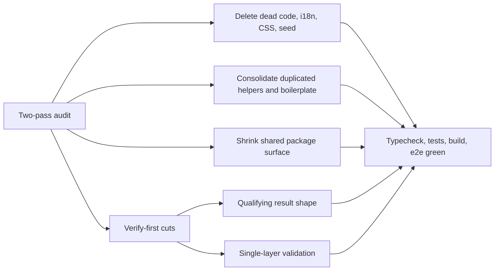

## prod_004_over_engineering_cleanup_product_brief - Over-engineering Cleanup Product Brief
> Date: 2026-07-15
> Status: Settled
> Related request: `req_033_over_engineering_cleanup_pass_1`
> Related backlog: `item_048_delete_dead_code_dead_i18n_keys_and_stray_files`
> Related task: `task_034_orchestrate_over_engineering_cleanup_pass_1`
> Related architecture: (none yet)
> Reminder: Update status, linked refs, scope, decisions, success signals, and open questions when you edit this doc.
> Non-semantic edit: added the required overview Mermaid diagram and synced the line-count goal and component-extraction non-goal with the pass-2 audit scope already captured in req_033.

# Overview
A deletion-first maintenance pass that removes dead code, dead translations, duplicated helpers, and speculative surface area identified by a repo-wide audit (two passes, 2026-07-15), so future feature work starts from a smaller, honest codebase.

# Goals
- Shrink the codebase by roughly 550 lines across both audit passes with zero behavior change.
- Make the shared package surface match what consumers actually use.
- Establish one validation layer per concern: shape at the route boundary, business rules in the store.
- Leave the i18n catalogs exactly matching the UI so future locale audits are trivial.

# Non-goals
- Do not redesign any UI surface or add speculative abstractions (the Modal wrapper and activeModal/ApiError refactors are explicitly rejected; component extraction is limited to the named duplications: SetupShell, LiveryPlate).
- Do not change gameplay, economy values, or simulation behavior.
- Do not touch the logics/ workflow corpus beyond this request chain.
- Do not add dependencies or tooling.

# Scope and guardrails
- In: scaffolded request, product, backlog, orchestration task, validation, and handoff context.
- Out: unrelated workflow docs and implementation of generated tasks.

# Key product decisions
- Use structured input as the source of truth for generated docs.
- Keep generated write paths local and repo-bounded.

# Success signals
- Generated docs pass lint and audit without broad manual rewrites.
- Context-pack output can be handed to an implementation agent directly.

# References
- Product back-reference: `item_048_delete_dead_code_dead_i18n_keys_and_stray_files`
- Task back-reference: `task_034_orchestrate_over_engineering_cleanup_pass_1`
