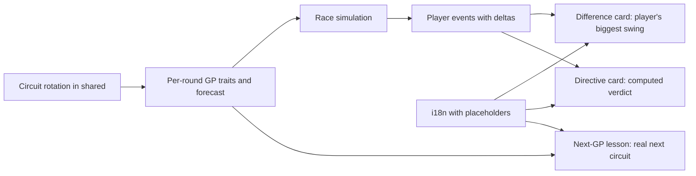

## prod_005_personalized_race_recap_product_brief - Personalized Race Recap Product Brief
> Date: 2026-07-15
> Status: Settled
> Related request: `req_034_personalized_race_recap`
> Related backlog: `item_054_derive_grand_prix_identity_from_the_circuit_rotation`
> Related task: `task_035_orchestrate_personalized_race_recap`
> Related architecture: (none yet)
> Reminder: Update status, linked refs, scope, decisions, success signals, and open questions when you edit this doc.
> Non-semantic edit: added the required overview Mermaid diagram after scaffold generation.

# Overview
Turn the post-race recap from three static sentences into the payoff moment of the strategy loop: the player sees what their own choices did to their race, judged against real simulation data, and leaves with advice that is true for the specific circuit coming next.

# Goals
- Close the strategy feedback loop: pick a directive, watch the race, understand precisely whether the directive worked and why.
- Give every Grand Prix a distinct identity (traits and forecast from its circuit) so preparation choices and advice have real stakes.
- Kill recap repetition: parameterized template pools over real race data instead of five canned sentences.
- Keep it cheap and local: no LLM, no new dependency, no new API endpoint — shared circuit data, a tiny i18n interpolation, and smarter selection over data the sim already emits.

# Non-goals
- No LLM-generated narrative (owner decision: cost, latency, dependency).
- No new race mechanics, cards, or economy changes — GP identity variation reuses existing trait/forecast inputs the sim already accepts.
- No redesign of the report layout, replay, or key-moments sections beyond the three recap cards.
- No rewrite of the simulation's event/report pipeline; consume typed event data as-is.
- No new locales or pluralization framework — {placeholder} substitution only.

# Scope and guardrails
- In: scaffolded request, product, backlog, orchestration task, validation, and handoff context.
- Out: unrelated workflow docs and implementation of generated tasks.

# Key product decisions
- Use structured input as the source of truth for generated docs.
- Keep generated write paths local and repo-bounded.

# Success signals
- Generated docs pass lint and audit without broad manual rewrites.
- Context-pack output can be handed to an implementation agent directly.

# References
- Product back-reference: `item_054_derive_grand_prix_identity_from_the_circuit_rotation`
- Task back-reference: `task_035_orchestrate_personalized_race_recap`
