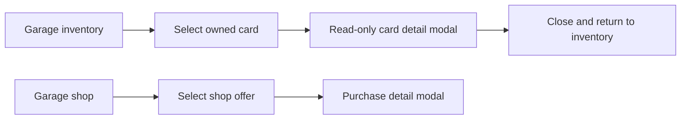

## prod_006_garage_inventory_card_consultation_product_brief - Garage Inventory Card Consultation Product Brief
> Date: 2026-07-15
> Status: Proposed
> Related request: `req_035_make_garage_inventory_cards_open_the_card_detail_modal`
> Related backlog: `item_057_add_read_only_card_detail_modal_for_garage_inventory`
> Related task: `task_036_orchestrate_garage_inventory_card_consultation`
> Related architecture: (none yet)
> Reminder: Update status, linked refs, scope, decisions, success signals, and open questions when you edit this doc.
> Non-semantic edit: added the required overview Mermaid diagram after scaffold generation.

# Overview
Inventory card consultation makes the Garage feel coherent: owned cards can be inspected with the same card-detail language as shop offers, without implying another purchase.

# Goals
- Help players understand owned cards before choosing them in race preparation.
- Make Inventory and Shop use the same card explanation pattern.
- Keep the Garage compact by opening details on demand instead of adding more inline text.
- Preserve the current shop purchase flow and economy rules.
- Improve accessibility by making owned cards discoverable through buttons with clear labels.

# Non-goals
- Do not add card selling, upgrading, rarity, crafting, or drag-and-drop inventory management.
- Do not change card prices, card fit logic, card definitions, or economy balance.
- Do not introduce a new reusable modal framework.
- Do not change the directive card picker behavior.
- Do not redesign the full Garage screen beyond the inventory-card click interaction.

# Scope and guardrails
- In: scaffolded request, product, backlog, orchestration task, validation, and handoff context.
- Out: unrelated workflow docs and implementation of generated tasks.

# Key product decisions
- Use structured input as the source of truth for generated docs.
- Keep generated write paths local and repo-bounded.

# Success signals
- Generated docs pass lint and audit without broad manual rewrites.
- Context-pack output can be handed to an implementation agent directly.

# References
- Product back-reference: `req_035_make_garage_inventory_cards_open_the_card_detail_modal`
- Task back-reference: `task_036_orchestrate_garage_inventory_card_consultation`
