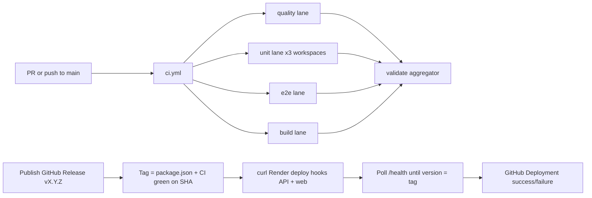

## prod_007_ci_and_release_pipeline_product_brief - CI and Release Pipeline Product Brief
> Date: 2026-07-15
> Status: Settled
> Related request: `req_036_github_ci_render_blueprint_and_release_contract`
> Related backlog: `item_058_author_the_render_blueprint_for_api_web_and_database`
> Related task: `task_037_orchestrate_ci_render_blueprint_and_release_contract`
> Related architecture: (none yet)
> Reminder: Update status, linked refs, scope, decisions, success signals, and open questions when you edit this doc.
> Non-semantic edit: added the required overview Mermaid diagram after scaffold generation.

# Overview
Give cr-league the same production discipline as its sibling projects: every change validated by a parallel CI before merge, a reproducible Render environment described in the repo, and a release contract where publishing a GitHub Release is the single gesture that deploys — gated by CI success before and version-verified health after.

# Goals
- Sub-slowest-lane CI wall-clock: quality, per-workspace unit tests, e2e, and build all run concurrently.
- One-gesture releases: publish a vX.Y.Z GitHub Release and the pipeline does the rest — CI gate, Render hooks, health verification.
- No deploy ambiguity: Render auto-deploy stays off; the only path to production is a published release whose CI passed.
- Reuse proven in-house patterns (cp-wc-26 blueprint and deploy gate, electrical-plan-editor CI lanes and aggregator, logics-manager version checks) instead of inventing new ones.

# Non-goals
- No release automation tooling (changesets, semantic-release, release-please) — version bumps and changelogs stay manual and curated, consistent with every sibling project.
- No test sharding yet — the per-workspace matrix is enough at the current suite size; sharding is the documented upgrade path.
- No staging environment, PR preview backend, or blue-green deploys.
- No Docker production image — Render builds from source via the blueprint.
- No cron/scheduled workflows in this request.

# Scope and guardrails
- In: scaffolded request, product, backlog, orchestration task, validation, and handoff context.
- Out: unrelated workflow docs and implementation of generated tasks.

# Key product decisions
- Use structured input as the source of truth for generated docs.
- Keep generated write paths local and repo-bounded.

# Success signals
- Generated docs pass lint and audit without broad manual rewrites.
- Context-pack output can be handed to an implementation agent directly.

# References
- Product back-reference: `item_058_author_the_render_blueprint_for_api_web_and_database`
- Task back-reference: `task_037_orchestrate_ci_render_blueprint_and_release_contract`
