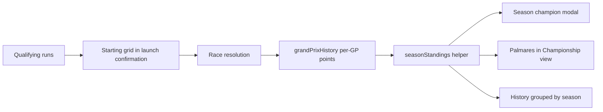

## prod_008_race_ceremony_and_season_narrative_product_brief - Race Ceremony and Season Narrative Product Brief
> Date: 2026-07-15
> Status: Proposed
> Related request: `req_037_starting_grid_modal_and_season_narrative`
> Related backlog: `item_062_show_the_starting_grid_in_the_race_launch_confirmation`, `item_063_derive_season_standings_and_celebrate_the_champion`, `item_064_group_the_gp_history_by_season`
> Related task: `task_038_orchestrate_starting_grid_and_season_narrative`
> Related architecture: (none yet)
> Reminder: Update status, linked refs, scope, decisions, success signals, and open questions when you edit this doc.
> Non-semantic edit: added the required overview Mermaid diagram after scaffold generation.

# Overview
Give the league loop its missing ceremonies: a starting-grid moment before every race so the qualifying effort pays off visibly, a champion celebration when a season ends, and a season-structured history so the league's story stays readable as it grows.

# Goals
- Make qualifying matter visibly: the grid recap is where the player sees their qualifying result turn into track position.
- Give seasons a payoff: a champion, a podium, and a final table that survive the points reset.
- Keep the league's past legible: seasons, not an ever-growing flat list of GPs.
- Stay schema-free: everything derives from data the app already stores.

# Non-goals
- No server-side season archive table or API change — derived from grandPrixHistory until scoring outgrows it (documented upgrade path).
- No new modal abstraction (req_033 decision) — reuse the existing modal-overlay pattern.
- No trophies, badges, cross-league records, or hall-of-fame art.
- No changes to scoring, rewards, or the rollover mechanics themselves.
- No pagination or virtualization of history — collapsible season groups are enough at current scale.

# Scope and guardrails
- In: scaffolded request, product, backlog, orchestration task, validation, and handoff context.
- Out: unrelated workflow docs and implementation of generated tasks.

# Key product decisions
- Use structured input as the source of truth for generated docs.
- Keep generated write paths local and repo-bounded.

# Success signals
- Generated docs pass lint and audit without broad manual rewrites.
- Context-pack output can be handed to an implementation agent directly.

# References
- Product back-reference: `req_037_starting_grid_modal_and_season_narrative`
- Task back-reference: `task_038_orchestrate_starting_grid_and_season_narrative`
