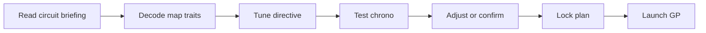

## prod_009_pit_wall_race_plan_product_brief - Pit Wall Race Plan Product Brief
> Date: 2026-07-16
> Status: Proposed
> Related request: `req_038_redesign_the_race_directive_into_a_clear_pit_wall_plan`
> Related backlog: `item_065_map_directive_choices_to_player_facing_race_plan_language`, `item_066_replace_directive_dropdowns_with_decision_cards`, `item_067_make_garage_card_selection_readable_inside_the_race_plan`, `item_068_add_a_dynamic_pit_wall_plan_summary`, `item_069_validate_directive_clarity_with_tests_and_screenshots`, `item_070_explain_circuit_traits_as_actionable_race_briefing`
> Related task: `task_039_orchestrate_pit_wall_race_plan_clarity`
> Related architecture: (none yet)
> Reminder: Update status, linked refs, scope, decisions, success signals, and open questions when you edit this doc.
> Non-semantic edit: added the required overview Mermaid diagram after scaffold generation.

# Overview
Pit Wall Race Plan turns the confusing start of a Grand Prix day into a readable team-principal loop. The player should understand the circuit telemetry, test a qualifying chrono, tune the race posture, optionally spend a garage card, lock the plan, and then launch the Grand Prix without needing another permanent help panel.

# Goals
- Make the core Grand Prix decision understandable to a first-time private playtest user.
- Make directive choices feel like team-principal strategy rather than an admin form.
- Turn map telemetry into understandable race briefing: what Grip, Overtaking, and Energy mean, and how they shape risk.
- Expose consequence in the UI: what the player is prioritizing, what risk they accept, and why a card fits or does not fit.
- Keep the existing simulation and API contracts unchanged so the work stays focused and low-risk.
- Improve localized English/French wording for the race planning moment.
- Leave the implementation easy to validate with current unit, Playwright, and Logics gates.
- Make the early race-day loop visible as a compact phase sequence rather than a set of disconnected controls.
- Explain qualifying chrono attempts as a way to test the current setup and improve grid position before the plan is locked.
- Reduce visible clutter by replacing repeated explanatory panels with current-step framing and concise objective text.

# Non-goals
- Do not add new directive options, new race mechanics, new cards, or balance changes.
- Do not build a full tutorial, coach bot, onboarding quest, or step-by-step guided mode.
- Do not redesign the entire cockpit, championship, garage, or replay surfaces in this request.
- Do not introduce a UI component library, routing framework, animation package, or global state manager.
- Do not change API payload shapes or Prisma models.
- Do not change circuit trait values, simulation balance, or the compact map telemetry indicators.
- Do not create final marketing copy or brand identity assets.
- Do not add a heavy tutorial, wizard, blocking onboarding modal, or another permanent help panel.
- Do not turn the race-day sequence into a rigid stepper that prevents experienced players from acting quickly.

# Scope and guardrails
- In: race-day phase framing, circuit briefing clarity, directive tuning clarity, qualifying chrono purpose, lock/launch transitions, localized copy, CSS, and regression tests.
- Out: new mechanics, new race balance, server/API changes, long tutorial content, and unrelated cockpit/replay redesign.
- Guardrail: prefer one compact current objective over adding another visible panel.
- Guardrail: the full sequence should be understandable, but experienced players should still be able to move quickly.

# Key product decisions
- The root issue is not only unclear directive controls; it is an unclear Grand Prix day loop.
- The desired sequence is `Circuit briefing -> Directive tuning -> Qualifying chrono -> Plan locked -> Grand Prix`.
- Chrono attempts must be framed as setup validation and grid-position improvement, not as an isolated optional button.
- Clarity should come from state, transitions, and concise objective copy rather than a new tutorial layer.

# Success signals
- A first-time player can say what they should do now, what chrono attempts are for, and when the plan becomes final.
- The cockpit reads as calmer after the redesign because explanatory clutter is consolidated.
- Existing create-league, qualifying, directive, launch-GP, and replay flows continue to pass validation.
- Desktop and mobile screenshots show no new overlap or information crowding.

# References
- Product back-reference: `req_038_redesign_the_race_directive_into_a_clear_pit_wall_plan`
- Task back-reference: `task_039_orchestrate_pit_wall_race_plan_clarity`
