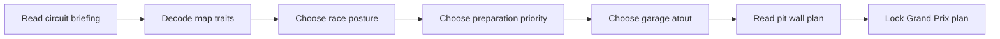

## prod_009_pit_wall_race_plan_product_brief - Pit Wall Race Plan Product Brief
> Date: 2026-07-16
> Status: Proposed
> Related request: `req_038_redesign_the_race_directive_into_a_clear_pit_wall_plan`
> Related backlog: `item_065_map_directive_choices_to_player_facing_race_plan_language`, `item_066_replace_directive_dropdowns_with_decision_cards`, `item_067_make_garage_card_selection_readable_inside_the_race_plan`, `item_068_add_a_dynamic_pit_wall_plan_summary`, `item_069_validate_directive_clarity_with_tests_and_screenshots`, `item_070_explain_circuit_traits_as_actionable_race_briefing`
> Related task: `task_039_orchestrate_pit_wall_race_plan_clarity`
> Related architecture: (none yet)
> Reminder: Update status, linked refs, scope, decisions, success signals, and open questions when you edit this doc.
> Non-semantic edit: added the required overview Mermaid diagram after scaffold generation.

# Overview
Pit Wall Race Plan turns the confusing Race directive panel into a readable team-principal decision moment. The player should understand the circuit telemetry, choose a race posture, prepare for a risk, optionally spend a garage card, and confidently lock the plan before the Grand Prix.

# Goals
- Make the core Grand Prix decision understandable to a first-time private playtest user.
- Make directive choices feel like team-principal strategy rather than an admin form.
- Turn map telemetry into understandable race briefing: what Grip, Overtaking, and Energy mean, and how they shape risk.
- Expose consequence in the UI: what the player is prioritizing, what risk they accept, and why a card fits or does not fit.
- Keep the existing simulation and API contracts unchanged so the work stays focused and low-risk.
- Improve localized English/French wording for the race planning moment.
- Leave the implementation easy to validate with current unit, Playwright, and Logics gates.

# Non-goals
- Do not add new directive options, new race mechanics, new cards, or balance changes.
- Do not build a full tutorial, coach bot, onboarding quest, or step-by-step guided mode.
- Do not redesign the entire cockpit, championship, garage, or replay surfaces in this request.
- Do not introduce a UI component library, routing framework, animation package, or global state manager.
- Do not change API payload shapes or Prisma models.
- Do not change circuit trait values, simulation balance, or the compact map telemetry indicators.
- Do not create final marketing copy or brand identity assets.

# Scope and guardrails
- In: scaffolded request, product, backlog, orchestration task, validation, and handoff context.
- Out: unrelated workflow docs and implementation of generated tasks.

# Key product decisions
- Use structured input as the source of truth for generated docs.
- Keep generated write paths local and repo-bounded.

# Success signals
- Generated docs pass lint and audit without broad manual rewrites.
- Context-pack output can be handed to an implementation agent directly.

# References
- Product back-reference: `req_038_redesign_the_race_directive_into_a_clear_pit_wall_plan`
- Task back-reference: `task_039_orchestrate_pit_wall_race_plan_clarity`
