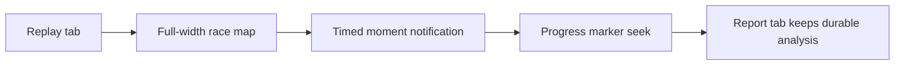

## prod_010_full_width_replay_moment_notifications_product_brief - Full-Width Replay Moment Notifications Product Brief
> Date: 2026-07-16
> Status: Settled
> Related request: `req_039_turn_replay_key_moments_into_timed_notifications`
> Related backlog: `item_071_remove_the_permanent_replay_key_moments_panel`
> Related task: `task_040_orchestrate_full_width_replay_moment_notifications`
> Related architecture: (none yet)
> Reminder: Update status, linked refs, scope, decisions, success signals, and open questions when you edit this doc.
> Non-semantic edit: added the required overview Mermaid diagram after scaffold generation.

# Overview
Full-Width Replay Moment Notifications makes the race replay feel like the live spectacle of the Grand Prix: the map becomes the stage, key moments arrive as timed notifications, and the report remains the place for calm post-race analysis.

# Goals
- Make the replay tab feel immersive and race-first instead of dashboard-first.
- Give the map the available width so movement, track, tower, and weather are easier to read.
- Surface key events at the moment they happen, so players connect cause, lap, and position impact naturally.
- Keep lightweight navigation through progress-bar markers for replaying important events.
- Preserve the report tab as the durable analysis surface.
- Keep the implementation cheap by reusing existing replay moment calculations and event text helpers.

# Non-goals
- Do not change the simulation model, race event generation, replay trace math, or result payloads.
- Do not add a cinematic broadcast engine, voiceover, camera cuts, or animation library.
- Do not remove the report tab or written recap.
- Do not introduce a global toast system or reusable notification framework unless the local replay implementation becomes duplicated.
- Do not redesign the entire result view beyond the replay tab layout and key moment presentation.
- Do not add new dependencies.

# Scope and guardrails
- In: scaffolded request, product, backlog, orchestration task, validation, and handoff context.
- Out: unrelated workflow docs and implementation of generated tasks.

# Key product decisions
- Use structured input as the source of truth for generated docs.
- Keep generated write paths local and repo-bounded.

# Success signals
- Generated docs pass lint and audit without broad manual rewrites.
- Context-pack output can be handed to an implementation agent directly.

# References
- Product back-reference: `item_071_remove_the_permanent_replay_key_moments_panel`
- Task back-reference: `task_040_orchestrate_full_width_replay_moment_notifications`
