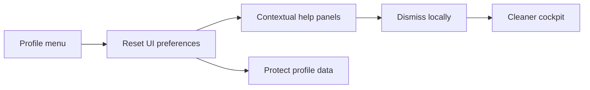

## prod_011_dismissible_help_panels_and_ui_preferences_product_brief - Dismissible Help Panels and UI Preferences Product Brief
> Date: 2026-07-16
> Status: Settled
> Related request: `req_040_add_dismissible_help_panels_and_ui_preference_reset`
> Related backlog: `item_075_define_the_ui_preference_storage_boundary`
> Related task: `task_041_orchestrate_dismissible_help_panels_and_ui_preference_reset`
> Related architecture: (none yet)
> Reminder: Update status, linked refs, scope, decisions, success signals, and open questions when you edit this doc.

# Overview
Dismissible Help Panels and UI Preferences lets CR League keep useful onboarding copy for new players while giving returning players a cleaner cockpit. Contextual panels can be closed and remembered, and the Profile menu provides a safe way to reset only UI preferences when the player wants guidance back.

> Non-semantic edit: added the required overview Mermaid diagram after scaffold generation.

# Goals
- Reduce repeated explanatory clutter for players who already understand Race prep and Race replay.
- Keep contextual help available and recoverable instead of deleting it from the interface.
- Make preference reset discoverable from the existing Profile menu.
- Protect durable player, profile, recovery, and league data from accidental deletion.
- Keep the implementation local and explicit by using stable localStorage keys and a small reset allowlist.
- Maintain accessible, localized controls in English and French.

# Non-goals
- Do not redesign the Profile menu beyond adding the reset preference action.
- Do not add accounts, server-side preference storage, database tables, or API endpoints.
- Do not clear profile session, player claims, active player claim, recovery code, league progress, or race state.
- Do not build a full settings screen or preference management framework.
- Do not introduce a global toast, modal, state manager, or dependency for this feature.
- Do not remove the contextual help copy from first-time player flows.

# Scope and guardrails
- In: dismissible Race prep and Race replay help panels, local persistence, Profile menu reset action, EN/FR copy, CSS, and regression tests.
- In: an explicit UI preference reset boundary covering dismissed help keys, replay preferences, and any chosen seen-state keys.
- Out: durable player/profile/league data, server-side preference storage, settings pages, and broader cockpit/replay redesign.
- Guardrail: reset behavior must use a narrow allowlist or prefix list; never use broad localStorage clearing.
- Guardrail: close/reset controls must remain keyboard accessible and localized.

# Key product decisions
- Dismissed panels are local-only UI preferences because they are convenience state, not league state.
- The Profile menu is the right recovery point because it already contains language, league, profile code, and profile reset actions.
- Reset UI preferences must be non-destructive and visually distinct from forgetting the profile.
- Language reset behavior must be decided explicitly during implementation instead of being swept into a generic reset.
- Dynamic season recap seen keys may be reset only through a narrow `cr-league-season-recap:` prefix rule.

# Success signals
- A returning player can close Race prep and Race replay explanatory panels and keep them hidden across reloads.
- The same player can restore guidance from the Profile menu without losing profile/session/player claim data.
- Tests prove reset safety by asserting durable localStorage keys survive.
- Mobile and desktop layouts remain stable after panels disappear or reappear.
- The implementation passes app validation and Logics closeout gates.

# References
- Product back-reference: `item_075_define_the_ui_preference_storage_boundary`
- Task back-reference: `task_041_orchestrate_dismissible_help_panels_and_ui_preference_reset`
