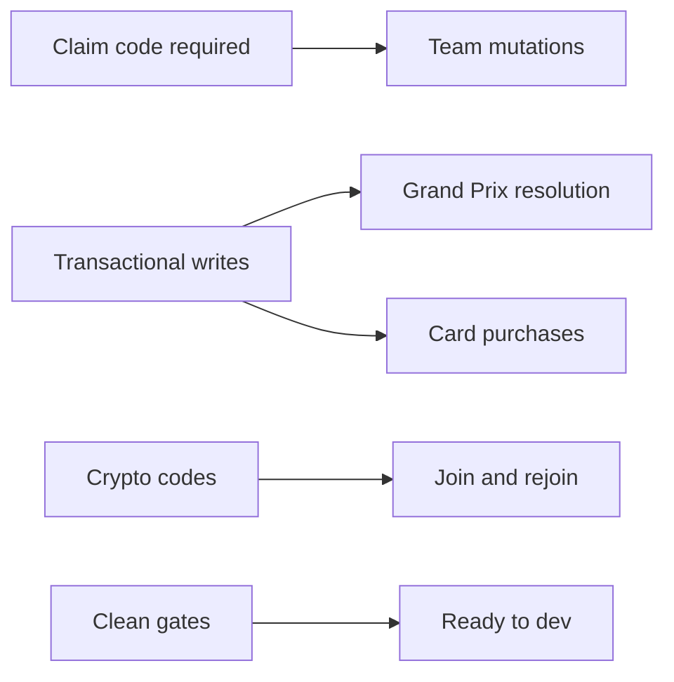

## prod_012_api_integrity_hardening_product_brief - API Integrity Hardening Product Brief
> Date: 2026-07-17
> Status: Settled
> Related request: `req_041_api_integrity_hardening_from_repo_review`
> Related backlog: `item_079_require_claim_codes_for_team_mutations`
> Related task: `task_042_orchestrate_api_integrity_hardening`
> Related architecture: (none yet)
> Reminder: Update status, linked refs, scope, decisions, success signals, and open questions when you edit this doc.

# Overview
A narrow hardening pass that closes the repo-review findings around player mutation authorization, concurrent economy writes, concurrent Grand Prix resolution, validation error handling, secure code generation, and lint reproducibility.

# Goals
- Make team ownership explicit at the API boundary without introducing a full authentication system.
- Use the database as the consistency boundary for race resolution and purchases.
- Keep endpoint behavior predictable: malformed or invalid user input never becomes a 500.
- Replace weak random identifiers with crypto-backed codes and simple collision retry.
- Leave the repo with all existing quality gates green.

# Non-goals
- Do not add user accounts, sessions, JWT, OAuth, or a permissions framework.
- Do not redesign the LeagueState response or profile recovery flow beyond the claimCode payload requirement.
- Do not replace JSON card inventory with a normalized inventory table in this pass unless atomic purchase cannot be made correct otherwise.
- Do not change gameplay balance, card prices, race scoring, or UI layout.
- Do not add dependencies for validation or locking.

# Scope and guardrails
- In: scaffolded request, product, backlog, orchestration task, validation, and handoff context.
- Out: unrelated workflow docs and implementation of generated tasks.

# Key product decisions
- Use structured input as the source of truth for generated docs.
- Keep generated write paths local and repo-bounded.

# Success signals
- Generated docs pass lint and audit without broad manual rewrites.
- Context-pack output can be handed to an implementation agent directly.

# References
- Product back-reference: `item_079_require_claim_codes_for_team_mutations`
- Task back-reference: `task_042_orchestrate_api_integrity_hardening`
