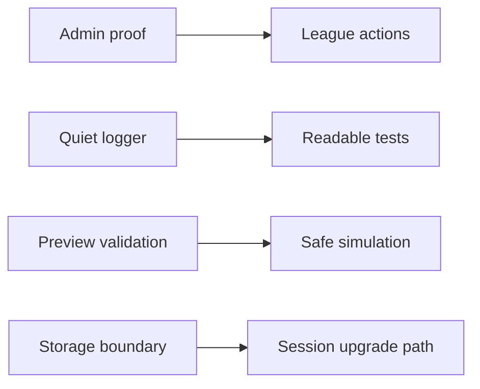

## prod_014_api_surface_follow_up_hardening_product_brief - API Surface Follow-up Hardening Product Brief
> Date: 2026-07-17
> Status: Settled
> Related request: `req_043_api_surface_follow_up_hardening`
> Related backlog: `item_088_add_minimal_admin_proof_to_league_level_mutations`
> Related task: `task_044_orchestrate_api_surface_follow_up_hardening`
> Related architecture: (none yet)
> Reminder: Update status, linked refs, scope, decisions, success signals, and open questions when you edit this doc.

# Overview
A companion hardening pass for the API surfaces not covered by the first integrity corpus: league-level authority, quieter tests, stricter simulation preview input validation, and explicit handling of prototype client-side secrets.

# Goals
- Prevent arbitrary callers from performing league administration actions with only a league id.
- Keep API test output useful by default while retaining logs for local debugging.
- Reject malformed simulation preview inputs at the route boundary.
- Make the current localStorage secret model explicit so future work upgrades it deliberately.

# Non-goals
- Do not build a full authentication or authorization framework.
- Do not add external validation libraries.
- Do not redesign profile recovery or stored claims.
- Do not change race simulation behavior for valid inputs.
- Do not normalize client preferences or move them server-side.

# Scope and guardrails
- In: scaffolded request, product, backlog, orchestration task, validation, and handoff context.
- Out: unrelated workflow docs and implementation of generated tasks.

# Key product decisions
- Use structured input as the source of truth for generated docs.
- Keep generated write paths local and repo-bounded.

# Success signals
- Generated docs pass lint and audit without broad manual rewrites.
- Context-pack output can be handed to an implementation agent directly.

# References
- Product back-reference: `item_088_add_minimal_admin_proof_to_league_level_mutations`
- Task back-reference: `task_044_orchestrate_api_surface_follow_up_hardening`
