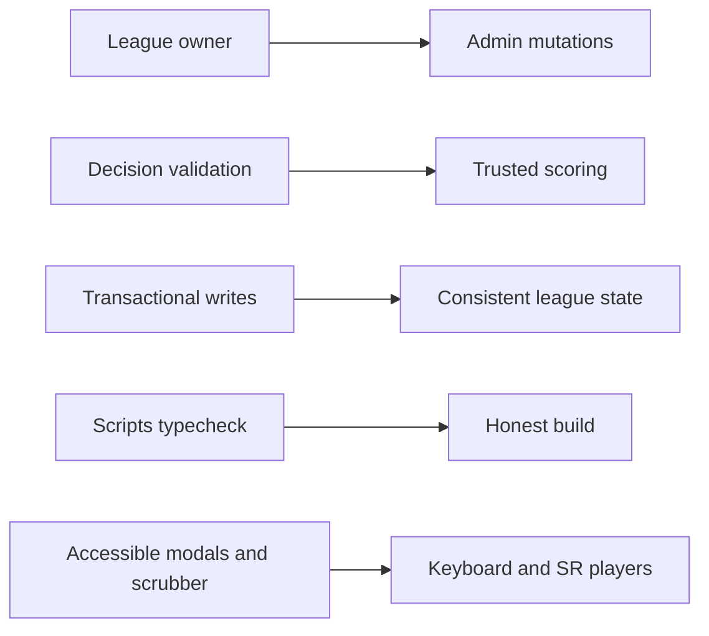

## prod_015_repo_review_remediation_pass_3_product_brief - Repo Review Remediation Pass 3 Product Brief
> Date: 2026-07-18
> Status: Settled
> Related request: `req_044_repo_review_remediation_pass_3_league_ownership_robustness_and_web_accessibility`
> Related backlog: `item_092_add_league_owner_and_gate_admin_mutations_on_it`
> Related task: `task_045_orchestrate_repo_review_remediation_pass_3`
> Related architecture: (none yet)
> Reminder: Update status, linked refs, scope, decisions, success signals, and open questions when you edit this doc.

# Overview
A third hardening pass driven by a full-repo review: close the league-authority gap left by the previous pass with a real owner concept, make the persisted decision path and concurrent write paths as strict as the preview path, bring scripts under the typecheck build, and fix the web app's accessibility and input-validation fundamentals.

# Goals
- Only the league owner can perform destructive league administration.
- Persisted league decisions are validated as strictly as preview inputs.
- Concurrent submissions and double-clicks cannot lose data or crash with 500s.
- The typecheck build covers every TypeScript entry point in the repo.
- Modals and the replay scrubber are keyboard and screen-reader operable.

# Non-goals
- Do not build accounts, sessions, JWT, or a roles/permissions system beyond a single owner reference.
- Do not add validation, focus-trap, or state-management dependencies.
- Do not migrate qualifyingRuns out of its JSON column in this pass.
- Do not change race simulation behavior for valid inputs.
- Do not decompose App.tsx or redesign existing UI beyond the listed accessibility fixes.

# Scope and guardrails
- In: scaffolded request, product, backlog, orchestration task, validation, and handoff context.
- Out: unrelated workflow docs and implementation of generated tasks.

# Key product decisions
- Use structured input as the source of truth for generated docs.
- Keep generated write paths local and repo-bounded.

# Success signals
- Generated docs pass lint and audit without broad manual rewrites.
- Context-pack output can be handed to an implementation agent directly.

# References
- Product back-reference: `item_092_add_league_owner_and_gate_admin_mutations_on_it`
- Task back-reference: `task_045_orchestrate_repo_review_remediation_pass_3`
