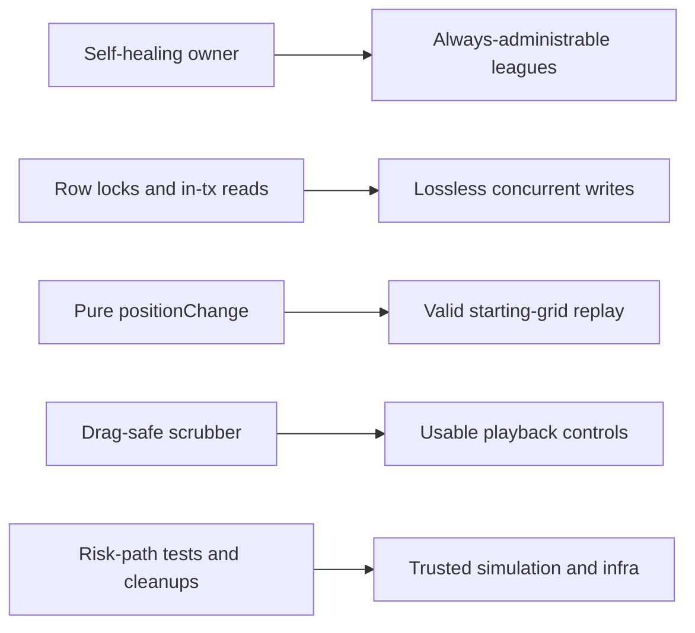

## prod_016_repo_review_remediation_pass_4_product_brief - Repo Review Remediation Pass 4 Product Brief
> Date: 2026-07-18
> Status: Proposed
> Related request: `req_045_repo_review_remediation_pass_4_ownership_resilience_race_window_closure_and_replay_polish`
> Related backlog: `item_098_self_healing_league_ownership`, `item_099_row_locks_and_in_transaction_reads_for_league_writes`, `item_100_restore_the_positionchange_invariant`, `item_101_replay_scrubber_interaction_polish`, `item_102_small_correctness_edges_across_web_and_shared`, `item_103_deferred_debt_sweep_risk_path_tests_script_and_config_cleanups`
> Related task: `task_046_orchestrate_repo_review_remediation_pass_4`
> Related architecture: (none yet)
> Reminder: Update status, linked refs, scope, decisions, success signals, and open questions when you edit this doc.

# Overview
A fourth remediation pass driven by the post-pass-3 review: make league ownership self-healing, close the last concurrency windows with real row locks and in-transaction reads, restore the positionChange invariant the replay depends on, polish the replay scrubber interaction, and clear the accumulated small-correctness and infra debt.

# Goals
- No league can become permanently unadministrable.
- Concurrent qualifying submissions cannot exceed the attempt limit or lose runs on real Postgres.
- Replay starting-grid reconstruction is always a valid permutation.
- The replay scrubber is fully usable during playback with a mouse, keyboard, or screen reader.
- The deferred low-severity debt from two review rounds is cleared in one sweep.

# Non-goals
- Do not migrate qualifyingRuns to a dedicated table unless row locking proves insufficient.
- Do not add ownership-transfer UI or multi-admin support.
- Do not rebalance card effects or change qualifying_focus semantics.
- Do not add rate limiting, sessions, or new dependencies.
- Do not restyle the replay view beyond the listed interaction fixes.

# Scope and guardrails
- In: scaffolded request, product, backlog, orchestration task, validation, and handoff context.
- Out: unrelated workflow docs and implementation of generated tasks.

# Key product decisions
- Use structured input as the source of truth for generated docs.
- Keep generated write paths local and repo-bounded.

# Success signals
- Generated docs pass lint and audit without broad manual rewrites.
- Context-pack output can be handed to an implementation agent directly.

# References
- Product back-reference: `req_045_repo_review_remediation_pass_4_ownership_resilience_race_window_closure_and_replay_polish`
- Task back-reference: `task_046_orchestrate_repo_review_remediation_pass_4`
