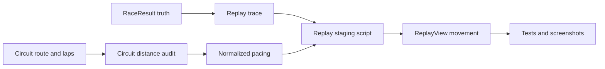

## prod_017_coherent_race_replay_and_simulation_realism_product_brief - Coherent Race Replay And Simulation Realism Product Brief
> Date: 2026-07-18
> Status: Proposed
> Related request: `req_046_make_race_simulation_and_replay_feel_coherent_across_circuits`
> Related backlog: `item_104_audit_and_normalize_circuit_race_distances`, `item_105_define_the_replay_staging_contract`, `item_106_implement_arcade_plausible_replay_movement`, `item_107_validate_replay_realism_with_tests_and_playtest_prompts`
> Related task: `task_047_orchestrate_coherent_replay_realism_and_circuit_normalization`
> Related architecture: (none yet)
> Reminder: Update status, linked refs, scope, decisions, success signals, and open questions when you edit this doc.

# Overview
Coherent Race Replay And Simulation Realism upgrades CR League's post-race spectacle from a technically correct trace viewer into a believable arcade race presentation: circuits keep distinct identities, race lengths feel comparable, and overtakes are staged from deterministic result data without adding a physics engine.

# Overview diagram

# Goals
- Make every resolved Grand Prix feel like the same sport, even when the city route shape changes.
- Keep simulation truth, rewards, and reports deterministic while allowing a richer presentation layer for replay movement.
- Enrich race output with replay-useful deterministic facts when the current `RaceResult` is too sparse, without turning it into an animation or UI contract.
- Normalize circuit lap counts or replay scaling from measured route distance and route complexity instead of manual guesswork.
- Favor larger, more flowing circuit profiles as the target replay feel instead of compressing the championship around the shortest or twistiest routes.
- Make overtakes and gaps readable through detailed scripted arcade beats that match the final result.
- Preserve the existing lightweight React/SVG map stack and avoid a new rendering engine unless proven necessary later.
- Give future AI contributors a clear implementation path, measurable acceptance criteria, and validation commands.

# Non-goals
- Do not build a full physics model, tire simulation, collision model, racing line solver, or real-time race AI.
- Do not change the player economy, rewards, card inventory rules, league cadence, or persistence model as part of this slice.
- Do not add Three.js, Pixi, Canvas game-loop infrastructure, audio, video, or cinematic broadcast tooling.
- Do not rewrite the map route data wholesale unless the audit proves a specific circuit route is unusable.
- Do not make replay presentation random; the same race result and circuit must produce the same replay script.
- Do not remove reports, classification, replay notifications, progress markers, or current result review surfaces.

# Scope and guardrails
- In: a repeatable circuit-distance audit covering route length, laps, total perceived distance, recommended laps, and outliers.
- In: a route-complexity signal that helps distinguish long flowing circuits from short twisty routes.
- In: lap-count or replay-scaling normalization that keeps city circuits distinct, favors longer and less twisty layouts as the reference feel, and makes race duration feel comparable.
- In: a deterministic replay staging adapter that converts simulation trace data into presentation beats for starts, pace windows, attack setup, close-follow phases, overtakes, defense, gap rebuilds, weather changes, key events, and finishes.
- In: minimal deterministic `RaceResult` enrichment when needed for replay quality: finer gaps, order-change facts, pressure windows, attack/defense context, momentum shifts, and event-to-replay metadata.
- In: replay integration, representative circuit QA, unit/e2e coverage, and playtest prompts for arcade-plausible realism.
- Out: physics, collision, tire models, live multiplayer watching, new rendering engines, audio/video broadcast features, economy changes, and unrelated UI redesign.

# Key product decisions
- Simulation output remains the source of truth for final classification, report semantics, rewards, and consumed cards.
- `RaceResult` may expose more race facts for replay, but those facts must remain deterministic domain data.
- Replay staging is presentation-only: it may shape timing and movement, but it must not change the race outcome.
- UI animation details belong in the replay staging/view layer, not in `RaceResult`.
- Circuit normalization starts from measured route display distance and route complexity instead of subjective lap-count tweaking.
- When two normalization targets both work, choose the one closer to the larger and more flowing circuits.
- Arcade-scripted overtakes are acceptable when deterministic and visually readable.
- Replay scripts should expose a readable debug or fixture view so tuning does not depend only on watching the UI.
- The current React/SVG map stack remains the default technology boundary unless a later request proves it insufficient.

# Success signals
- The measured spread between shortest and longest perceived race distance is intentionally bounded or documented as an exception.
- Players can watch a pass happen through setup, close gap, overlap or offset, swap, defend or counter, and settle phases instead of a sudden ranking jump.
- Implementation agents can inspect the replay plan directly and understand why a pass, gap, or weather beat appears at a given moment.
- New replay facts in `RaceResult`, if added, are testable, deterministic, and explain race-story beats without encoding display animation.
- Short, long, wet, technical, and high-overtaking circuits all frame the replay clearly on desktop and mobile.
- The same race result and circuit produce the same replay script every time.
- Validation covers normalization math, replay staging determinism, final-order preservation, representative e2e replay behavior, and Logics closeout proof.

# References
- Product back-reference: `req_046_make_race_simulation_and_replay_feel_coherent_across_circuits`
- Task back-reference: `task_047_orchestrate_coherent_replay_realism_and_circuit_normalization`
