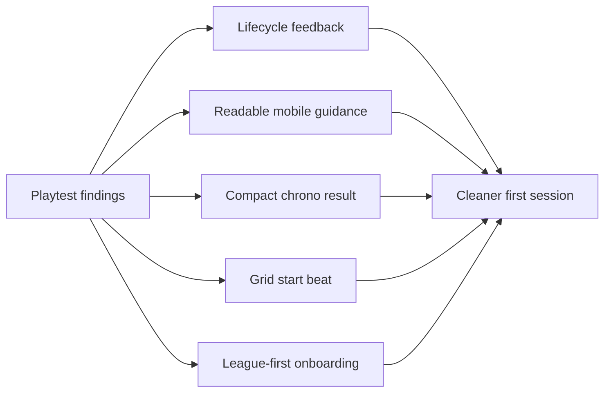

## prod_018_first_session_ux_polish_product_brief - First Session UX Polish Product Brief
> Date: 2026-07-18
> Status: Proposed
> Related request: `req_047_polish_first_session_ux_after_playtest_findings`
> Related backlog: `item_108_replace_stale_notification_stacking_with_command_lifecycle_feedback`, `item_109_make_mobile_race_guidance_readable_without_shrinking_the_circuit`, `item_110_replace_automatic_chrono_replay_with_a_compact_qualifying_result_flow`, `item_111_add_a_readable_staged_grid_start_beat_to_race_replay`, `item_112_lead_onboarding_with_the_league_promise_before_profile_mechanics`
> Related task: `task_048_orchestrate_first_session_ux_polish_from_playtest_findings`
> Related architecture: (none yet)
> Reminder: Update status, linked refs, scope, decisions, success signals, and open questions when you edit this doc.

# Overview
This polish pass turns the current playable CR League first session into a cleaner, more confident experience: feedback stops contradicting itself, mobile instructions stay readable, repeated chronos move faster, replay starts read like a race, and onboarding leads with the league fantasy before account mechanics.

# Overview diagram

# Goals
- Make command feedback feel trustworthy by replacing stale loading messages instead of stacking them.
- Preserve the strong cockpit/map visual identity while keeping controls and guidance readable on desktop and mobile.
- Reduce friction in the first Grand Prix loop, especially repeated qualifying attempts.
- Make replay starts immediately understandable before the field transitions into staged race movement.
- Make new players understand the core promise of creating and running a racing league before asking them to manage access.
- Keep implementation small and local to existing React, CSS, i18n, and test surfaces.

# Non-goals
- Do not redesign the entire app navigation, garage economy, card system, or race simulation.
- Do not add a third-party toast/notification library, animation library, or routing framework.
- Do not remove profile recovery, saved league claims, invite-code joining, or existing local preferences.
- Do not make formal visual-regression infrastructure mandatory for this pass.
- Do not change race outcomes, rewards, standings, card consumption, or replay fact generation semantics.

# Scope and guardrails
- In: notification lifecycle and placement, mobile Race guidance, qualifying result flow, replay grid-start presentation, onboarding copy/CTA hierarchy, localized copy, tests, and playtest proof.
- Out: race outcome math, card economy, league cadence, profile/recovery APIs, saved-claim persistence, full app navigation redesign, and new UI/animation dependencies.

# Key product decisions
- Command feedback should behave like one lifecycle per command, not a historical stack of toasts.
- Mobile Race should keep the circuit large, but the next instruction must remain readable through a compact expandable pattern.
- Qualifying replay is valuable but should be explicit after a run; the default post-run state should help the player decide whether to run again, review, or lock.
- Replay grid start belongs in the presentation layer and must not change simulation truth or final classification.
- Onboarding should lead with "start/run a racing league"; profile creation is framed as saving access to that league.

# Success signals
- No stale loading notification remains visible after a command success in desktop or mobile playtests.
- Race mobile guidance exposes the active step instruction without essential truncation at 390px width.
- A player can run repeated qualifying attempts without being forced through the full replay each time.
- Replay start screenshots show readable car separation before normal race movement begins.
- The first screen's primary CTA and headline communicate the league/racing promise before account mechanics.
- Typecheck, lint, unit tests, build, e2e, i18n validation, and Logics validation pass at closeout.

# References
- Product back-reference: `req_047_polish_first_session_ux_after_playtest_findings`
- Task back-reference: `task_048_orchestrate_first_session_ux_polish_from_playtest_findings`
