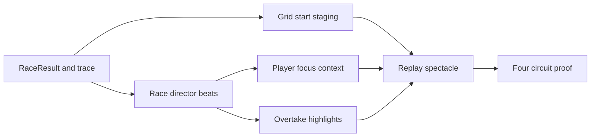

## prod_019_replay_spectacle_fun_pass_product_brief - Replay Spectacle Fun Pass Product Brief
> Date: 2026-07-18
> Status: Proposed
> Related request: `req_048_make_race_replay_feel_like_a_fun_race_spectacle`
> Related backlog: `item_113_add_deterministic_grid_start_staging_to_replay`, `item_114_generate_race_director_beats_from_replay_facts_and_trace`, `item_115_show_player_race_focus_context_during_replay`, `item_116_add_overtake_and_position_change_highlights`, `item_117_validate_replay_spectacle_across_circuits_and_quiet_stretches`
> Related task: `task_049_orchestrate_replay_spectacle_fun_pass`
> Related architecture: (none yet)
> Reminder: Update status, linked refs, scope, decisions, success signals, and open questions when you edit this doc.

# Overview
Replay Spectacle Fun Pass makes CR League's resolved GP replay feel like a small race broadcast instead of a passive telemetry map: starts are staged, action is called out, the player's race is legible, overtakes pop, and quiet phases still carry tension through truthful deterministic beats.

# Overview diagram

# Goals
- Make the first seconds of replay immediately read as a race start.
- Help players understand why positions are changing without reading the full report.
- Make the player team's story visible even when the player is not leading.
- Create small high-impact visual moments around overtakes, card effects, weather windows, pressure, and final laps.
- Keep every spectacle element deterministic and derived from existing race facts, trace, events, and circuit context.
- Reuse the existing React/SVG replay stack and keep the implementation light.

# Non-goals
- Do not change race outcomes, rewards, scoring, card consumption, qualifying math, or simulation balancing.
- Do not build a full broadcast system, commentator script engine, audio layer, timeline editor, replay editor, or analytics stack.
- Do not add Three.js, Canvas, Pixi, or a third-party animation/notification library.
- Do not duplicate the global notification cleanup from `item_108`; treat it as a dependency for final visual quality.
- Do not make fake race events that contradict the result, trace, report, or final classification.

# Scope and guardrails
- In: replay grid-start staging, deterministic race-director beats, player focus context, overtake/position-change highlights, quiet rhythm beats, localized UI copy, replay tests, e2e/playtest proof, and Logics closeout.
- Out: simulation outcome changes, card/economy balancing, report rewrite, audio, 3D/canvas renderer, formal screenshot diffing, and global notification cleanup except as a dependency.

# Key product decisions
- Replay spectacle is presentation-only. It may explain or highlight race state, but must not change classification, rewards, cards, reports, or event truth.
- The race-director layer should be small and deterministic, built from `RaceResult`, replay trace, replay facts, weather, events, and classification.
- The player team's race needs explicit context even when the player is not fighting for the lead.
- Overtakes should be visible in at least one of three places at once: car/local badge, tower row, or timeline marker.
- Quiet stretches should be narrated only with truthful rhythm beats derived from gaps, order, weather, or lap phase.
- Global notification cleanup from `item_108` remains a visual dependency and should be resolved before final replay screenshots.

# Success signals
- The opening seconds read as a grid launch in desktop and mobile screenshots.
- A viewer can tell what the important current beat is without opening the report.
- A player can understand their own position trend and nearby gaps during replay.
- Position changes produce a clear visual cue and remain deterministic when seeking.
- Quiet stretches still feel intentional through pack/gap/weather/final-lap beats.
- Validation covers at least four circuits and records full gate results.

# References
- Product back-reference: `req_048_make_race_replay_feel_like_a_fun_race_spectacle`
- Task back-reference: `task_049_orchestrate_replay_spectacle_fun_pass`
