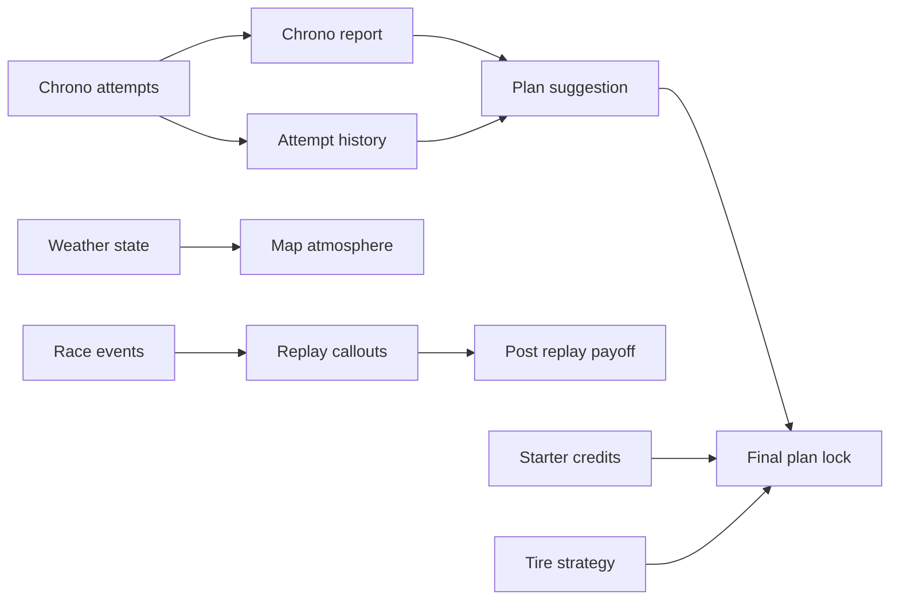

## prod_020_race_learning_and_feedback_systems_product_brief - Race Learning and Feedback Systems Product Brief
> Date: 2026-07-18
> Status: Settled
> Related request: `req_049_race_learning_and_feedback_systems`
> Related backlog: `item_118_add_dynamic_chrono_report_after_each_qualifying_attempt`
> Related task: `task_050_orchestrate_race_learning_and_feedback_systems`
> Related architecture: (none yet)
> Reminder: Update status, linked refs, scope, decisions, success signals, and open questions when you edit this doc.

# Overview
Turn each Grand Prix day into a clearer learning loop: test configurations through chrono attempts, understand what worked, lock a plan with evidence, watch a more expressive race, then receive a concrete payoff summary that guides the next decision.

# Overview diagram

# Goals
- Make chrono attempts meaningful by explaining what each tested configuration proved or failed to prove.
- Help players lock plans from evidence rather than guesswork.
- Make the race map and replay more alive without rewriting the simulation or rendering stack.
- Make post-race payoff immediately understandable after replay time investment.
- Improve first-session agency by moving the first card choice into the garage economy.
- Keep tire strategy small and readable if added.

# Non-goals
- No AI-generated coaching or LLM dependency.
- No new full telemetry dashboard outside the current race desk/report surfaces.
- No replay engine rewrite.
- No complex tire degradation model, pit-stop strategy, stint planning, or per-lap tire simulation in this corpus.
- No economy overhaul beyond starter credits/card inventory and the tests required by that change.
- No new locales.

# Scope and guardrails
- In: chrono reports, chrono history, chrono-backed plan suggestions, weather map visuals, replay event callouts, post-replay payoff recap, starter economy adjustment, simple tire strategy, localized copy, and validation proof.
- Out: AI coaching, new telemetry dashboard, replay engine rewrite, full tire degradation model, pit stops, complex economy rebalance, new locales, or unrelated visual redesigns.

# Key product decisions
- Chrono coaching should be computed from existing `QualifyingRun` decision/result data before adding new API storage.
- Plan suggestions must explain evidence and preserve player agency; no silent auto-apply.
- Weather and event visuals are presentation layers over existing map/replay facts, not simulation changes.
- Starter economy should make the first garage visit intentional: no default card, enough credits to choose an early card.
- Tire strategy is last because it crosses shared types, API validation, simulation, UI, and tests.

# Success signals
- Players understand which chrono configuration performed best and why.
- The plan confirmation can reference the best observed chrono evidence.
- The map visibly reflects weather while remaining readable on mobile.
- Replay events are visible near cars without cluttering the race view.
- Post-replay payoff clearly shows position, points, credits, card spend, and relevant movement.
- A new player reaches the garage with an intentional card choice instead of an unexplained starter card.
- Each backlog item can be developed independently with focused tests and shared final gates.

# References
- Product back-reference: `item_118_add_dynamic_chrono_report_after_each_qualifying_attempt`
- Task back-reference: `task_050_orchestrate_race_learning_and_feedback_systems`
