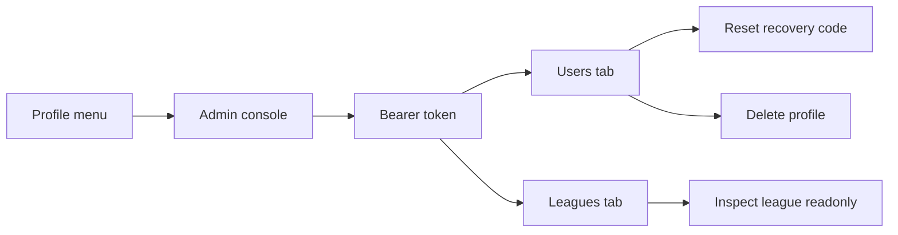

## prod_021_admin_operations_console_product_brief - Admin Operations Console Product Brief
> Date: 2026-07-19
> Status: Settled
> Related request: `req_050_add_a_secured_admin_operations_console`
> Related backlog: `item_126_add_secured_admin_api_operations`
> Related task: `task_051_orchestrate_secured_admin_operations_console`
> Related architecture: (none yet)
> Reminder: Update status, linked refs, scope, decisions, success signals, and open questions when you edit this doc.
> Confidence: 90

# Overview
The admin operations console gives trusted operators a small, secured way to inspect users and leagues, reset recovery access, remove accounts, and enter league contexts without touching the database directly.

# Overview diagram

# Goals
- Make support and playtest operations possible from the application instead of direct SQL.
- Keep global admin access explicitly gated by server-side environment configuration.
- Protect recovery-code security by supporting reset-and-show-once rather than plaintext lookup.
- Give operators a concise read of profiles and leagues before adding heavier operational actions.
- Preserve the player-facing cockpit and profile flows for non-admin users.

# Non-goals
- Do not add a full RBAC or multi-admin user-management system.
- Do not store plaintext recovery codes or make existing recovery codes recoverable.
- Do not add bulk destructive actions.
- Do not add league mutation actions such as force-resolve, force-next-GP, reset league, or delete league in the first slice.
- Do not redesign the whole profile menu or cockpit navigation.
- Do not expose admin credentials through Vite build-time environment variables.

# Scope and guardrails
- In:
  - Server-side `ADMIN_TOKEN` configuration for all `/admin/*` API routes.
  - Bearer-token admin API for users, recovery reset, profile deletion, league listing, and league inspection.
  - Profile-menu Admin entry that opens a token-gated console.
  - Users and Leagues admin tabs with focused operational actions.
  - Read-only league inspection mode that loads league state without a player claim.
- Out:
  - Admin roles, RBAC, or database schema changes.
  - Plaintext recovery-code storage or recovery-code reveal.
  - Bulk destructive actions.
  - League mutation tools beyond read-only inspection.

# Key product decisions
- Use `Authorization: Bearer <token>` and a server-side `ADMIN_TOKEN`; no admin credential is embedded in Vite build-time config.
- Keep the admin token in React memory for the current screen session instead of durable browser storage.
- Implement recovery support as reset-and-show-once because only recovery hashes are stored.
- Deleting a profile intentionally leaves linked teams in place with `profileId` cleared, matching the Prisma `onDelete: SetNull` relation.
- Reuse the existing league-state shape for admin inspection and omit `player`, so normal claim-gated player mutations remain unavailable.

# Success signals
- Focused API tests cover token rejection, user listing without recovery hashes, recovery reset, profile deletion, league listing, and admin league inspection.
- Focused React tests cover profile-menu Admin entry, bearer-token fetches, Users/Leagues tabs, reset/delete flows, and inspection mode.
- `npm run lint`, `npm run typecheck`, `npm test`, and Logics validation pass before closeout.

# References
- Product back-reference: `item_126_add_secured_admin_api_operations`
- Task back-reference: `task_051_orchestrate_secured_admin_operations_console`
