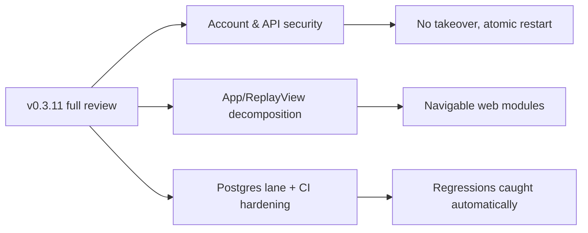

## prod_022_repo_review_remediation_pass_5_product_brief - Repo Review Remediation Pass 5 Product Brief
> Date: 2026-07-20
> Status: Settled
> Related request: `req_058_repo_review_remediation_pass_5_account_security_api_trust_boundaries_web_decomposition_and_ci_hardening`
> Related backlog: `item_135_brute_force_resistant_account_recovery`
> Related task: `task_059_orchestrate_repo_review_remediation_pass_5`
> Related architecture: (none yet)
> Non-semantic edit: 2026-07-20 added overview Mermaid diagram.
> Reminder: Update status, linked refs, scope, decisions, success signals, and open questions when you edit this doc.

# Overview

A fifth remediation pass driven by the v0.3.11 full-repo review: make account recovery brute-force resistant, close the remaining API trust-boundary gaps, make league restart atomic, decompose the two god components on the web, exercise the concurrency machinery against real Postgres in CI, and harden the CI/lint/release toolchain so these classes of defects are caught automatically next time.

# Goals
- Account takeover via recovery-code brute force is not feasible online or offline.
- No API endpoint trusts a client-supplied identity or leaks a join secret.
- A failed league restart can never brick a league.
- App.tsx and ReplayView.tsx become navigable modules that new UI work can extend without merge pain.
- Row locks and transactional claims are proven against real Postgres on every CI run.
- Lint, coverage, dependency scanning, and the release gate catch regressions of this pass automatically.

# Non-goals
- Do not build full session-based authentication or user passwords; profile-ownership proof reuses the existing recovery/claim material.
- Do not add rate-limiting infrastructure beyond an in-process limiter (no Redis, no new dependencies).
- Do not migrate qualifyingRuns to a dedicated table or convert Prisma string columns to enums.
- Do not restyle any screen; web changes are structural decomposition only.
- Do not change the ownership self-healing behavior shipped in pass 4.
- Do not expand e2e coverage beyond what the decomposition requires to stay green.

# Scope and guardrails
- In: scaffolded request, product, backlog, orchestration task, validation, and handoff context.
- Out: unrelated workflow docs and implementation of generated tasks.

# Key product decisions
- Use structured input as the source of truth for generated docs.
- Keep generated write paths local and repo-bounded.

# Success signals
- Generated docs pass lint and audit without broad manual rewrites.
- Context-pack output can be handed to an implementation agent directly.

# References
- Product back-reference: `item_135_brute_force_resistant_account_recovery`
- Task back-reference: `task_059_orchestrate_repo_review_remediation_pass_5`
