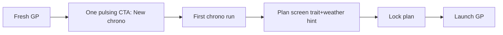

## prod_023_first_gp_action_clarity_product_brief - First-GP Action Clarity Product Brief
> Date: 2026-07-20
> Status: Proposed
> Related request: `req_059_first_gp_action_clarity_one_recommended_cta_plan_recommendation_and_vocabulary_harmonization`
> Related backlog: `item_141_single_recommended_cta_at_grand_prix_start`, `item_142_compact_circuit_and_weather_recommendation_on_the_plan_screen`, `item_143_harmonize_first_session_vocabulary_in_en_and_fr`
> Related task: `task_060_orchestrate_first_gp_action_clarity`
> Related architecture: (none yet)
> Non-semantic edit: 2026-07-20 added overview Mermaid diagram.
> Reminder: Update status, linked refs, scope, decisions, success signals, and open questions when you edit this doc.

# Overview

Roadmap patch 0.3.16: make the first minutes of a Grand Prix unambiguous. One pulsing CTA (New chrono) at GP start, one compact circuit/weather recommendation on the plan screen, and one term per concept across the first-session vocabulary in EN and FR.

# Goals
- A first-time player always knows the single next action at GP start.
- The plan screen tells the player what the track rewards before they lock a plan.
- League, championship, plan, chrono, and launch each have exactly one label per locale.

# Non-goals
- Do not change the desk phase machine or the qualifying/plan flows.
- Do not redesign the plan screen beyond the one recommendation line.
- Do not add onboarding tours, tooltips systems, or new preference toggles.
- Do not touch the report or replay vocabulary beyond the five listed concepts.

# Scope and guardrails
- In: scaffolded request, product, backlog, orchestration task, validation, and handoff context.
- Out: unrelated workflow docs and implementation of generated tasks.

# Key product decisions
- Use structured input as the source of truth for generated docs.
- Keep generated write paths local and repo-bounded.

# Success signals
- Generated docs pass lint and audit without broad manual rewrites.
- Context-pack output can be handed to an implementation agent directly.

# References
- Product back-reference: `req_059_first_gp_action_clarity_one_recommended_cta_plan_recommendation_and_vocabulary_harmonization`
- Task back-reference: `task_060_orchestrate_first_gp_action_clarity`
