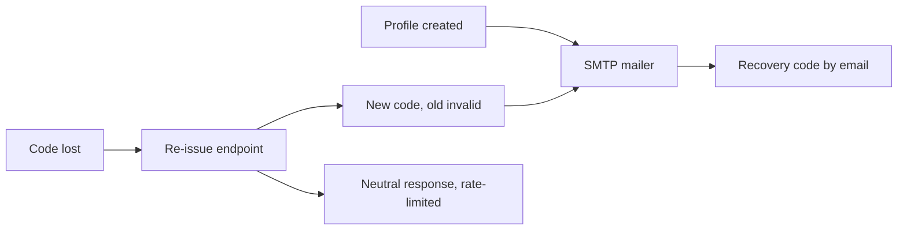

## prod_025_email_backed_profile_recovery_product_brief - Email-Backed Profile Recovery Product Brief
> Date: 2026-07-20
> Status: Settled
> Related request: `req_061_email_backed_profile_recovery_send_codes_on_creation_and_self_service_re_issue`
> Related backlog: `item_146_minimal_smtp_mailer_module_and_configuration`
> Related task: `task_062_orchestrate_email_backed_profile_recovery`
> Related architecture: (none yet)
> Non-semantic edit: 2026-07-20 added overview Mermaid diagram.
> Reminder: Update status, linked refs, scope, decisions, success signals, and open questions when you edit this doc.

# Overview

Roadmap patch 0.4.1: a minimal SMTP mailer sends the recovery code at profile creation and lets players re-issue a fresh code to their email without admin support, building on the hardened code generation, hashing, and rate limiting from remediation pass 5.

# Goals
- Losing the onboarding code no longer requires admin intervention.
- Recovery email works on the documented Gmail-over-SMTP setup with zero code changes when the operator rotates credentials.
- Local development and CI never send real mail.

# Non-goals
- Do not build email verification, magic links, or password auth.
- Do not add templating systems, queues, or delivery tracking; one plain-text email suffices.
- Do not change the recovery-code format, hashing, or rate limiter beyond consuming item_135's output.
- Do not remove the admin reset path; it stays as the fallback.
- Do not add a custom sending domain or DKIM setup (documented Gmail setup only).

# Scope and guardrails
- In: scaffolded request, product, backlog, orchestration task, validation, and handoff context.
- Out: unrelated workflow docs and implementation of generated tasks.

# Key product decisions
- Use structured input as the source of truth for generated docs.
- Keep generated write paths local and repo-bounded.

# Success signals
- Generated docs pass lint and audit without broad manual rewrites.
- Context-pack output can be handed to an implementation agent directly.

# References
- Product back-reference: `item_146_minimal_smtp_mailer_module_and_configuration`
- Task back-reference: `task_062_orchestrate_email_backed_profile_recovery`
