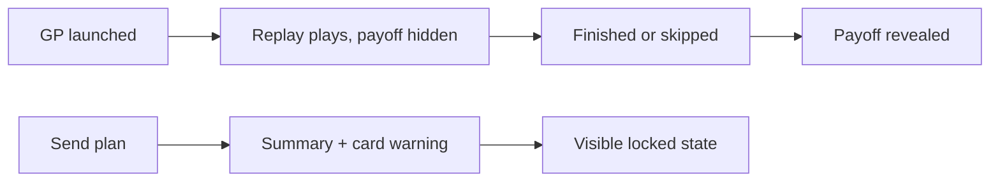

## prod_026_replay_suspense_and_first_contact_polish_product_brief - Replay Suspense and First-Contact Polish Product Brief
> Date: 2026-07-20
> Status: Settled
> Related request: `req_062_replay_suspense_and_first_contact_polish_from_the_2026_07_20_ai_playtest`
> Related backlog: `item_149_gate_the_race_payoff_on_replay_completion`
> Related task: `task_063_orchestrate_replay_suspense_and_first_contact_polish`
> Related architecture: (none yet)
> Non-semantic edit: 2026-07-20 added overview Mermaid diagram.
> Reminder: Update status, linked refs, scope, decisions, success signals, and open questions when you edit this doc.

# Overview

Playtest-driven patch 0.3.18: keep the race outcome hidden until the replay has told its story, cut the double-click and dead-Enter frictions from the first minutes, persist seen intros, and fix the two readability papercuts (attempt rank labels, duplicate key moments) the 2026-07-20 AI playtest surfaced.

# Goals
- The replay is watched with the outcome genuinely unknown.
- The first chrono is one click and every setup form submits on Enter.
- Intros are seen once per league, not once per reload.
- A calm race's report reads as curated, not filler.

# Non-goals
- Do not change simulation output, event generation, or the trace format.
- Do not redesign the replay bar, payoff content, or report sections.
- Do not touch the recommended-CTA logic (req_059) or the verdict block (req_060).
- Do not add settings or preferences beyond the existing UI-preferences storage.

# Scope and guardrails
- In: scaffolded request, product, backlog, orchestration task, validation, and handoff context.
- Out: unrelated workflow docs and implementation of generated tasks.

# Key product decisions
- Use structured input as the source of truth for generated docs.
- Keep generated write paths local and repo-bounded.

# Success signals
- Generated docs pass lint and audit without broad manual rewrites.
- Context-pack output can be handed to an implementation agent directly.

# References
- Product back-reference: `item_149_gate_the_race_payoff_on_replay_completion`
- Task back-reference: `task_063_orchestrate_replay_suspense_and_first_contact_polish`
