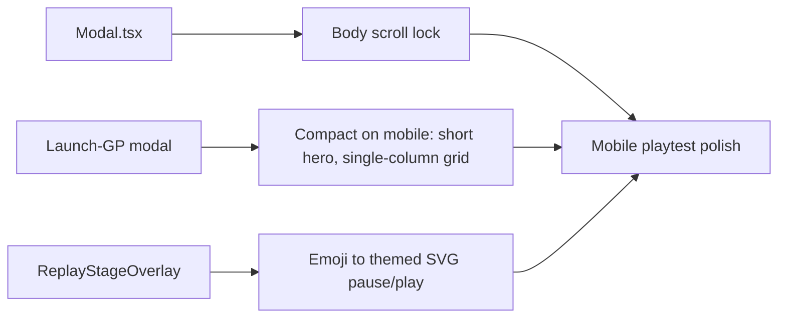

## prod_028_mobile_modal_hygiene_and_playback_icons_product_brief - Mobile Modal Hygiene and Playback Icons Product Brief
> Date: 2026-07-20
> Status: Proposed
> Related request: `req_064_mobile_modal_hygiene_and_real_playback_icons`
> Related backlog: `item_154_lock_background_scroll_behind_modals`, `item_155_make_the_launch_grand_prix_modal_compact_on_mobile`, `item_156_replace_the_emoji_playback_control_with_a_themed_svg_icon`
> Related task: `task_065_orchestrate_mobile_modal_hygiene_and_playback_icons`
> Related architecture: (none yet)
> Non-semantic edit: 2026-07-20 added overview Mermaid diagram.
> Reminder: Update status, linked refs, scope, decisions, success signals, and open questions when you edit this doc.

# Overview

Three mobile-playtest polish fixes with no gameplay impact: lock page scroll behind modals so only the dialog scrolls, make the launch-Grand-Prix confirmation modal compact enough to stay inside a phone viewport, and replace the emoji pause/play control with a drawn theme icon. Small, file-isolated diffs that keep the playtest loop feeling finished on mobile.

# Goals
- Modals never let the background scroll on mobile; only their own content scrolls.
- The launch-Grand-Prix modal stays fully within a phone viewport on both axes.
- Playback controls look identical across clients by using a drawn icon.

# Non-goals
- No changes to game logic, simulation, API, or the set of i18n keys (reuse existing action_pause/action_play).
- No broader modal-system redesign or shared icon library; scope is these three fixes.
- No unrelated refactors of the App/UI shell files Codex is concurrently decomposing.

# Scope and guardrails
- In: scaffolded request, product, backlog, orchestration task, validation, and handoff context.
- Out: unrelated workflow docs and implementation of generated tasks.

# Key product decisions
- Use structured input as the source of truth for generated docs.
- Keep generated write paths local and repo-bounded.

# Success signals
- Generated docs pass lint and audit without broad manual rewrites.
- Context-pack output can be handed to an implementation agent directly.

# References
- Product back-reference: `req_064_mobile_modal_hygiene_and_real_playback_icons`
- Task back-reference: `task_065_orchestrate_mobile_modal_hygiene_and_playback_icons`
