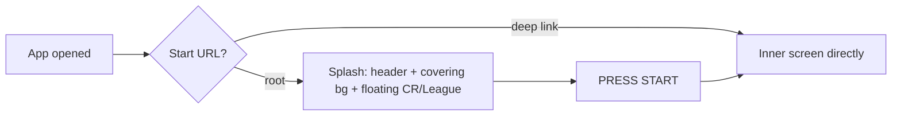

## prod_029_home_splash_landing_screen_product_brief - Home Splash Landing Screen Product Brief
> Date: 2026-07-20
> Status: Proposed
> Related request: `req_065_home_splash_landing_screen_with_floating_title_and_press_start`
> Related backlog: `item_157_gate_a_home_splash_on_the_start_url_with_deep_link_bypass`, `item_158_build_the_splash_layout_header_covering_background_floating_titles_press_start`
> Related task: `task_066_orchestrate_the_home_splash_landing_screen`
> Related architecture: (none yet)
> Non-semantic edit: 2026-07-20 added overview Mermaid diagram.
> Reminder: Update status, linked refs, scope, decisions, success signals, and open questions when you edit this doc.

# Overview

A first-contact landing screen for CR League: opened at the start URL, it presents the brand with a centered background, floating 'CR' and 'League' title art, and a PRESS START button that drops the player into the game as if the splash were not there. Deep links bypass it so shared/bookmarked routes are unaffected. Header and theming reuse existing components and tokens; the detoured, optimized assets are already in the repo.

# Goals
- Give the app a branded, arcade-style front door on first open without changing what happens after PRESS START.
- Fit the background cleanly on both desktop and mobile and keep the title art floating and legible.
- Never intercept deep links or add persisted state; the splash is a thin, additive gate on the root URL.

# Non-goals
- No changes to onboarding, SetupGate, profile session, or any inner screen behavior.
- No persisted 'seen splash' flag, no routing library change, and no restructure of App.tsx beyond a thin additive wrapper.
- No new asset generation — the home-* assets already exist in apps/web/public/assets/crl/.
- No animation library or new design-token system.

# Scope and guardrails
- In: scaffolded request, product, backlog, orchestration task, validation, and handoff context.
- Out: unrelated workflow docs and implementation of generated tasks.

# Key product decisions
- Use structured input as the source of truth for generated docs.
- Keep generated write paths local and repo-bounded.

# Success signals
- Generated docs pass lint and audit without broad manual rewrites.
- Context-pack output can be handed to an implementation agent directly.

# References
- Product back-reference: `req_065_home_splash_landing_screen_with_floating_title_and_press_start`
- Task back-reference: `task_066_orchestrate_the_home_splash_landing_screen`
