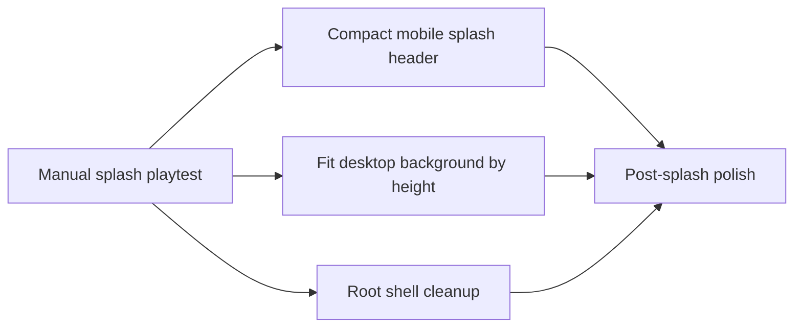

## prod_030_post_splash_playtest_polish_product_brief - Post-splash Playtest Polish Product Brief
> Date: 2026-07-20
> Status: Proposed
> Related request: `req_066_post_splash_playtest_polish_mobile_header_and_root_shell_cleanup`
> Related backlog: `item_159_compact_the_splash_header_on_narrow_mobile`, `item_160_clean_up_app_root_locale_ownership_and_hooks_warning`
> Related task: `task_067_orchestrate_post_splash_playtest_polish`
> Related architecture: (none yet)
> Reminder: Update status, linked refs, scope, decisions, success signals, and open questions when you edit this doc.

# Overview

A small follow-up after the home splash landed: keep the new first-contact screen visually comfortable on mobile, keep the desktop background from over-zooming, and clean up the root shell code that was intentionally kept thin for delivery. The scope is limited to splash framing/header compactness, locale ownership, and the existing App.tsx Hooks warning while preserving the validated splash and league flow.

# Goals
- Improve the mobile splash header's first impression without changing inner app headers.
- Fit the desktop splash background by height and blend any side fill so the artwork is not oversized.
- Make locale ownership clear across the splash gate and entered app.
- Remove the lingering App.tsx lint warning without changing onboarding/session behavior.

# Non-goals
- No redesign or regeneration of the splash artwork, title assets, or PRESS START interaction.
- No persisted splash-seen state or routing model change.
- No broad App.tsx decomposition beyond the minimum needed for locale and hook hygiene.
- No new visual assets, dependencies, or design-token system.

# Scope and guardrails
- In: scaffolded request, product, backlog, orchestration task, validation, and handoff context.
- Out: unrelated workflow docs and implementation of generated tasks.

# Key product decisions
- Use structured input as the source of truth for generated docs.
- Keep generated write paths local and repo-bounded.

# Success signals
- Generated docs pass lint and audit without broad manual rewrites.
- Context-pack output can be handed to an implementation agent directly.

# References
- Product back-reference: `req_066_post_splash_playtest_polish_mobile_header_and_root_shell_cleanup`
- Task back-reference: `task_067_orchestrate_post_splash_playtest_polish`
