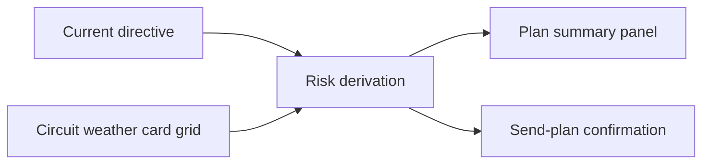

## prod_031_plan_risk_readability_product_brief - Plan Risk Readability Product Brief
> Date: 2026-07-20
> Status: Settled
> Related request: `req_067_plan_risk_readability_layer`
> Related backlog: `item_161_derive_deterministic_plan_risk_reads`, `item_162_render_plan_risk_summary_before_commitment`
> Related task: `task_068_orchestrate_plan_risk_readability_layer`
> Related architecture: (none yet)
> Reminder: Update status, linked refs, scope, decisions, success signals, and open questions when you edit this doc.
> Non-semantic edit: 2026-07-20 added overview Mermaid diagram.

# Overview

A pre-race readability layer that tells players what kind of plan they are about to send: safe, risky, or high-upside. It turns existing directive/circuit/weather/card context into a short explanation before commitment, without changing the race simulation.

# Goals
- Help players understand the consequence profile of their directive before sending it.
- Make plan choices feel causal by naming the intended finishing band and tradeoff.
- Create a natural pre-race counterpart to the post-race verdict/report work.

# Non-goals
- No simulation rewrite, no probability model, and no new persisted plan fields.
- No broad redesign of PlanView or the send-plan modal.
- No promise that the summary predicts the exact result.

# Scope and guardrails
- In: scaffolded request, product, backlog, orchestration task, validation, and handoff context.
- Out: unrelated workflow docs and implementation of generated tasks.

# Key product decisions
- Use structured input as the source of truth for generated docs.
- Keep generated write paths local and repo-bounded.

# Success signals
- Generated docs pass lint and audit without broad manual rewrites.
- Context-pack output can be handed to an implementation agent directly.

# References
- Product back-reference: `req_067_plan_risk_readability_layer`
- Task back-reference: `task_068_orchestrate_plan_risk_readability_layer`
