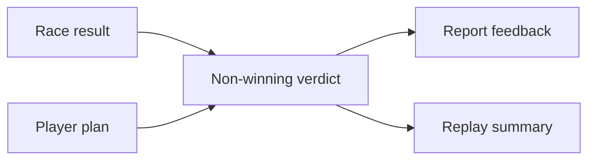

## prod_032_non_winning_success_feedback_product_brief - Non-winning Success Feedback Product Brief
> Date: 2026-07-20
> Status: Settled
> Related request: `req_068_non_winning_success_feedback`
> Related backlog: `item_163_derive_non_winning_success_verdicts`, `item_164_surface_non_winning_feedback_in_reports`
> Related task: `task_069_orchestrate_non_winning_success_feedback`
> Related architecture: (none yet)
> Reminder: Update status, linked refs, scope, decisions, success signals, and open questions when you edit this doc.
> Non-semantic edit: 2026-07-20 added overview Mermaid diagram.

# Overview

A result-feedback pass that recognizes when a player did something valuable without winning. Defensive, economy, and weather plans can earn clear explanatory praise when the data supports it, helping the game feel less binary while preserving existing rewards and standings.

# Goals
- Make non-winning outcomes legible and emotionally fair.
- Reinforce causal planning by naming what the plan protected or converted.
- Keep reward economy unchanged while improving feedback quality.

# Non-goals
- No new missions/objective selection system.
- No additional rewards, standings adjustments, or simulation changes.
- No broad report redesign.

# Scope and guardrails
- In: derive non-winning feedback from existing result, decision, weather, card-event, points, and credits data.
- In: render compact report feedback with EN/FR copy for success and miss states.
- Out: simulation, reward, standings, persisted result-shape, explicit mission, and broad report redesign changes.

# Key product decisions
- Keep non-winning feedback as a derived web view model so the race engine and economy remain unchanged.
- Show success only when the data supports a concrete preserved-position, weather/card, or economy/future-option explanation.
- Show honest miss copy for poor results so a zero-point low finish does not read like a complete success.
- Reuse the existing Report surface with a compact panel directly under the main race verdict.

# Success signals
- Players can see why a non-win still had value when the plan preserved position, limited weather/card loss, or saved future option value.
- Poor non-winning outcomes receive clear try-next guidance instead of success framing.
- Validation covers helper derivation, report rendering, i18n, full app tests, e2e flow, and Logics closeout.

# References
- Product back-reference: `req_068_non_winning_success_feedback`
- Task back-reference: `task_069_orchestrate_non_winning_success_feedback`
