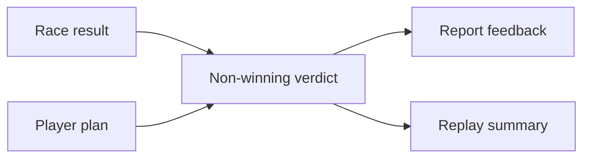

## prod_032_non_winning_success_feedback_product_brief - Non-winning Success Feedback Product Brief
> Date: 2026-07-20
> Status: Proposed
> Related request: `req_068_non_winning_success_feedback`
> Related backlog: `item_163_derive_non_winning_success_verdicts`, `item_164_surface_non_winning_feedback_in_reports`
> Related task: `task_069_orchestrate_non_winning_success_feedback`
> Related architecture: (none yet)
> Reminder: Update status, linked refs, scope, decisions, success signals, and open questions when you edit this doc.
> Non-semantic edit: 2026-07-20 added overview Mermaid diagram.

# Overview

A result-feedback pass that recognizes when a player did something valuable without winning. Defensive, economy, and weather plans can earn clear explanatory praise when the data supports it, helping the game feel less binary while preserving existing rewards and standings.

# Goals
- Make non-winning outcomes legible and emotionally fair.
- Reinforce causal planning by naming what the plan protected or converted.
- Keep reward economy unchanged while improving feedback quality.

# Non-goals
- No new missions/objective selection system.
- No additional rewards, standings adjustments, or simulation changes.
- No broad report redesign.

# Scope and guardrails
- In: scaffolded request, product, backlog, orchestration task, validation, and handoff context.
- Out: unrelated workflow docs and implementation of generated tasks.

# Key product decisions
- Use structured input as the source of truth for generated docs.
- Keep generated write paths local and repo-bounded.

# Success signals
- Generated docs pass lint and audit without broad manual rewrites.
- Context-pack output can be handed to an implementation agent directly.

# References
- Product back-reference: `req_068_non_winning_success_feedback`
- Task back-reference: `task_069_orchestrate_non_winning_success_feedback`
