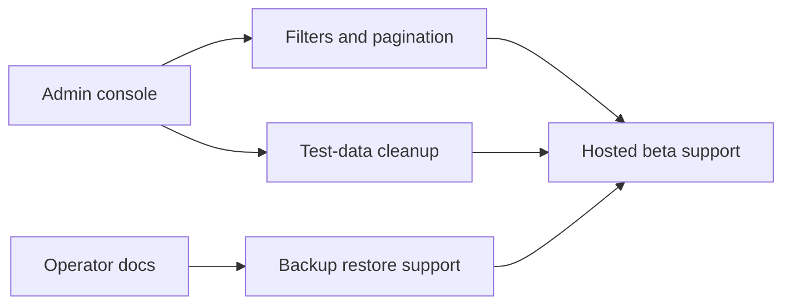

## prod_033_beta_support_hardening_product_brief - Beta Support Hardening Product Brief
> Date: 2026-07-20
> Status: Proposed
> Related request: `req_069_beta_support_hardening`
> Related backlog: `item_165_add_admin_filters_and_pagination`, `item_166_add_safe_admin_test_data_cleanup`, `item_167_write_beta_support_runbooks_and_known_limits`
> Related task: `task_070_orchestrate_beta_support_hardening`
> Related architecture: (none yet)
> Reminder: Update status, linked refs, scope, decisions, success signals, and open questions when you edit this doc.
> Non-semantic edit: 2026-07-20 added overview Mermaid diagram.

# Overview

Operational hardening for a hosted beta: make admin support usable with filters and pagination, provide a conservative test-data cleanup action, and document backup/restore/support procedures so a small beta can run without ad hoc database intervention.

# Goals
- Let admins inspect and support growing beta data safely.
- Provide a narrow, confirmation-gated path to clean test data sets.
- Give operators and testers clear known-limits and recovery documentation.

# Non-goals
- No full authentication system.
- No public user self-service deletion flow.
- No broad production data wipe tooling.
- No analytics or customer-support platform integration.

# Scope and guardrails
- In: scaffolded request, product, backlog, orchestration task, validation, and handoff context.
- Out: unrelated workflow docs and implementation of generated tasks.

# Key product decisions
- Use structured input as the source of truth for generated docs.
- Keep generated write paths local and repo-bounded.

# Success signals
- Generated docs pass lint and audit without broad manual rewrites.
- Context-pack output can be handed to an implementation agent directly.

# References
- Product back-reference: `req_069_beta_support_hardening`
- Task back-reference: `task_070_orchestrate_beta_support_hardening`
