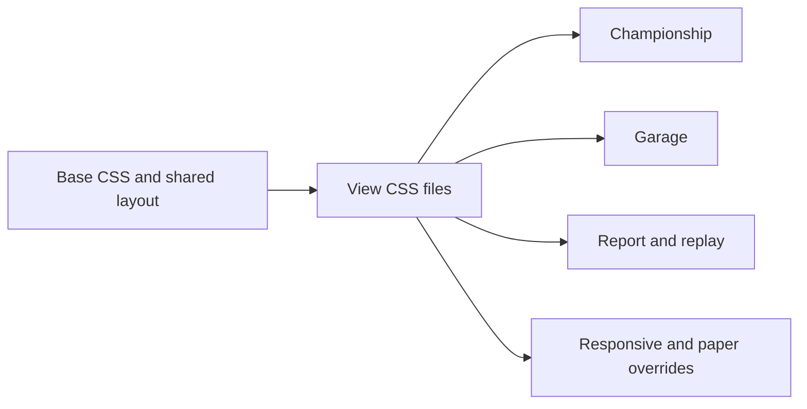

## prod_035_web_stylesheet_modularization_product_brief - Web Stylesheet Modularization Product Brief
> Date: 2026-07-21
> Status: Settled
> Related request: `req_071_modularize_the_large_web_layout_stylesheet`
> Related backlog: `item_169_extract_feature_css_from_layout_css`
> Related task: `task_072_orchestrate_web_stylesheet_modularization`
> Related architecture: (none yet)
> Reminder: Update status, linked refs, scope, decisions, success signals, and open questions when you edit this doc.

# Overview
Split CR League's large monolithic web stylesheet into maintainable feature files while preserving the current UI and preparing the codebase for later route-level CSS loading.

# Goals
- Reduce the blast radius of CSS edits.
- Make feature styles discoverable by area.
- Keep the visual design stable during extraction.
- Create a simple import structure that supports future lazy-loaded CSS.

# Non-goals
- Do not redesign the UI or rename class names unless required for a conflict.
- Do not adopt CSS modules, CSS-in-JS, Sass, Tailwind, or another styling framework.
- Do not chase tiny gzip wins at the cost of risky selectors.
- Do not change user-facing copy or application behavior.

# Scope and guardrails
- In: mechanical extraction of bounded CSS sections into imported files while preserving cascade order.
- In: feature files for championship, garage, report/replay, responsive behavior, paper material, directive telemetry, plan steps, and pit-wall numerals.
- Out: selector renames, visual redesign, CSS modules, CSS-in-JS, Sass, Tailwind, or new styling dependencies.

# Key product decisions
- Keep plain CSS imports in `main.tsx`; this matches the existing Vite app style and avoids new indirection.
- Preserve cascade by importing extracted files in their original source order after `layout.css`.
- Keep shared tokens, reset/base, shell layout, buttons, panel primitives, and modal primitives in the existing base/layout files.
- Accept equivalent bundle size for this pass; runtime CSS splitting can follow later once view-level CSS loading is explicitly designed.

# Success signals
- `layout.css` is materially shorter and the view sections are easier to find.
- Reconstructed CSS is equivalent to the previous monolithic stylesheet apart from whitespace.
- Production CSS is not larger and representative e2e flows remain green.

# References
- Product back-reference: `req_071_modularize_the_large_web_layout_stylesheet`
- Task back-reference: `task_072_orchestrate_web_stylesheet_modularization`
