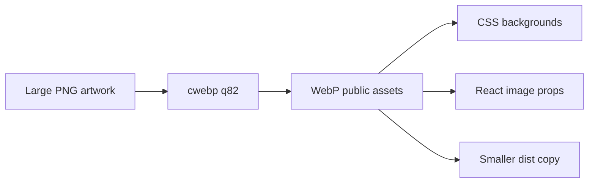

## prod_036_webp_artwork_delivery_product_brief - WebP Artwork Delivery Product Brief
> Date: 2026-07-21
> Status: Settled
> Related request: `req_072_serve_large_web_artwork_as_webp`
> Related backlog: `item_170_convert_largest_artwork_assets_to_webp`
> Related task: `task_073_orchestrate_webp_artwork_conversion`
> Related architecture: (none yet)
> Reminder: Update status, linked refs, scope, decisions, success signals, and open questions when you edit this doc.

# Overview
Serve CR League's largest remaining artwork in a lighter browser-native format so rich visuals remain without carrying avoidable PNG transfer cost.

# Goals
- Cut remaining large artwork payload without changing UI design.
- Use the existing public asset pipeline.
- Target only assets where WebP gives meaningful savings.
- Keep the implementation simple enough to maintain manually.

# Non-goals
- Do not introduce a full image CDN, responsive image service, or build-time image processing pipeline.
- Do not convert tiny sprites, flags, fonts, or car assets unless measurements justify it.
- Do not regenerate artwork content.
- Do not change layout, copy, or interaction behavior.

# Scope and guardrails
- In: convert the seven largest targeted CRL artwork assets to WebP, update references, and remove replaced PNGs from public delivery.
- Out: broad image pipeline automation, AVIF, tiny sprites, fonts, car assets, layout changes, copy changes, and artwork regeneration.

# Key product decisions
- Use local `cwebp` with quality 82 for this manual conversion pass.
- Serve WebP directly for targeted CSS and React paths because the supported browser target is modern and already accepts WebP.
- Remove replaced PNGs from `public` so Vite does not copy duplicate assets to `dist`; PNG masters can be recovered from git history if needed.
- Do not extend `AssetImage` with `<picture>` fallback until a real unsupported-browser requirement appears.

# Success signals
- Each converted image is materially smaller while preserving dimensions.
- Production build includes WebP targets and no targeted PNG references remain.
- `apps/web/dist` and `apps/web/public/assets/crl` are smaller after conversion.

# References
- Product back-reference: `req_072_serve_large_web_artwork_as_webp`
- Task back-reference: `task_073_orchestrate_webp_artwork_conversion`
