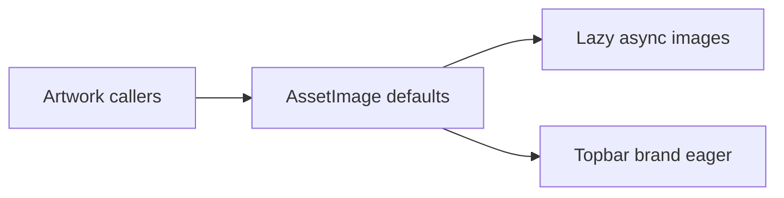

## prod_037_lazy_artwork_loading_product_brief - Lazy Artwork Loading Product Brief
> Date: 2026-07-21
> Status: Settled
> Related request: `req_073_lazy_load_non_critical_web_artwork`
> Related backlog: `item_171_add_lazy_defaults_to_assetimage`
> Related task: `task_074_orchestrate_lazy_artwork_loading`
> Related architecture: (none yet)
> Reminder: Update status, linked refs, scope, decisions, success signals, and open questions when you edit this doc.

# Overview
Make CR League's reusable image component lazy-load non-critical artwork by default so rich visuals do not compete with the first interaction path.

# Goals
- Reduce unnecessary initial image work.
- Keep image behavior centralized and predictable.
- Preserve priority loading for first-screen images where needed.
- Avoid dependencies and broad call-site churn.

# Non-goals
- Do not change artwork files or formats.
- Do not lazy-load CSS background images in this slice.
- Do not implement custom IntersectionObserver logic.
- Do not redesign ModalHero or image layout.

# Scope and guardrails
- In: scaffolded request, product, backlog, orchestration task, validation, and handoff context.
- Out: unrelated workflow docs and implementation of generated tasks.

# Key product decisions
- Use native `loading` and `decoding` image attributes through the existing `AssetImage` component.
- Keep topbar brand images eager because they are visible identity on first paint.
- Do not add an image-loading dependency or custom observer for this slice.

# Success signals
- Non-priority `AssetImage` output is lazy/async by default.
- Priority callers can keep eager behavior by passing native image props.
- Typecheck, lint, unit tests, build, and Logics validation pass.

# References
- Product back-reference: `req_073_lazy_load_non_critical_web_artwork`
- Task back-reference: `task_074_orchestrate_lazy_artwork_loading`
