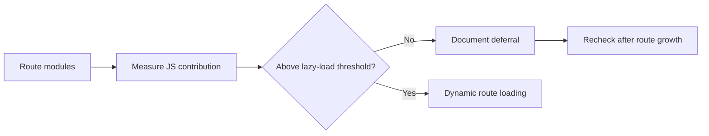

## prod_038_circuit_route_loading_audit_product_brief - Circuit Route Loading Audit Product Brief
> Date: 2026-07-21
> Status: Settled
> Related request: `req_074_audit_circuit_data_impact_before_optimizing_route_loading`
> Related backlog: `item_172_measure_and_decide_on_circuit_route_lazy_loading`
> Related task: `task_075_orchestrate_circuit_route_loading_audit`
> Related architecture: (none yet)
> Reminder: Update status, linked refs, scope, decisions, success signals, and open questions when you edit this doc.

# Overview
Measure and, only if justified, reduce the initial bundle cost of detailed circuit geometry while preserving map, replay, and simulation coherence.

# Goals
- Make a measured decision about circuit route lazy loading.
- Avoid speculative complexity if route modules are not a meaningful payload source.
- Keep circuit identities and display routes aligned.
- Leave a clear threshold for future circuit additions.

# Non-goals
- Do not redraw or redesign circuits.
- Do not change race simulation, lap counts, or replay behavior unless a loading boundary requires a small adapter.
- Do not introduce a data fetching endpoint for static circuit routes.
- Do not add a bundle analyzer dependency unless simple Vite output is insufficient.

# Scope and guardrails
- In: route module byte measurement, Vite/esbuild evidence, threshold decision, and closeout documentation.
- Out: dynamic imports for route geometry unless the measured threshold is crossed.
- Out: circuit redraws, simulation/lap behavior, replay choreography, and static route API work.

# Key product decisions
- Defer route lazy loading at the current 25-route catalog size.
- Ship lazy loading only when route geometry exceeds 75 KB gzip in initial JS measurement, 30% of production main chunk source share, or 40 detailed route modules.
- Keep the current synchronous route contract while route data remains below threshold because Drive, chrono, replay, and qualifying trace generation all depend on ready route geometry.

# Success signals
- Measured route contribution is recorded in a tracked report.
- The lazy-loading decision includes a concrete future trigger.
- Existing map, chrono, GP, and replay flows stay unchanged and validation passes.

# References
- Product back-reference: `req_074_audit_circuit_data_impact_before_optimizing_route_loading`
- Task back-reference: `task_075_orchestrate_circuit_route_loading_audit`
- Measurement report: `docs/audits/circuit-route-loading-audit-2026-07-21.md`
