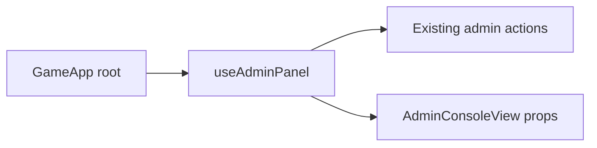

## prod_039_gameapp_decomposition_product_brief - GameApp Decomposition Product Brief
> Date: 2026-07-21
> Status: Settled
> Related request: `req_075_extract_the_admin_panel_state_cluster_from_gameapp_into_a_hook`
> Related backlog: `item_173_extract_useadminpanel_from_gameapp`
> Related task: `task_076_orchestrate_gameapp_admin_panel_hook_extraction`
> Related architecture: (none yet)
> Reminder: Update status, linked refs, scope, decisions, success signals, and open questions when you edit this doc.

# Overview
Incrementally break the oversized GameApp root component into cohesive custom hooks, starting with the admin panel, to lower maintenance risk without changing behavior.

# Goals
- Reduce the number of hooks and lines living directly in GameApp.
- Establish a repeatable, behavior-preserving extract-to-hook pattern.
- Keep the admin console fully working through the change.
- Ship the smallest safe slice first (admin), leaving follow-up slices for later requests.

# Non-goals
- Do not add a state-management, routing, or data-fetching library.
- Do not change admin UX, layout, copy, or the /admin/* API.
- Do not extract the other clusters (replay, onboarding/help, profile) in this request.
- Do not alter gameplay, persistence, or i18n.

# Scope and guardrails
- In: scaffolded request, product, backlog, orchestration task, validation, and handoff context.
- Out: unrelated workflow docs and implementation of generated tasks.

# Key product decisions
- Extract only the admin state cluster first; leave replay, onboarding/help, and profile clusters for later requests.
- Reuse `createAdminActions` unchanged inside `useAdminPanel`.
- Keep `AdminConsoleView` props stable to avoid UI churn.

# Success signals
- `GameApp` no longer declares admin-only `useState` hooks inline.
- Admin console tests and private-league Playwright flow pass unchanged.
- Typecheck, lint, unit tests, build, and Logics validation pass.

# References
- Product back-reference: `req_075_extract_the_admin_panel_state_cluster_from_gameapp_into_a_hook`
- Task back-reference: `task_076_orchestrate_gameapp_admin_panel_hook_extraction`
