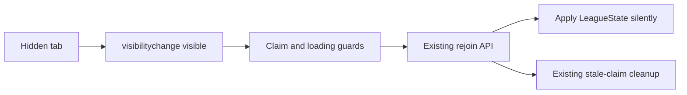

## prod_040_league_state_freshness_on_return_product_brief - League State Freshness On Return Product Brief
> Date: 2026-07-21
> Status: Settled
> Related request: `req_076_refresh_league_state_when_the_player_returns_to_the_tab`
> Related backlog: `item_174_refresh_active_league_on_tab_return`
> Related task: `task_077_orchestrate_league_state_freshness_on_return`
> Related architecture: (none yet)
> Reminder: Update status, linked refs, scope, decisions, success signals, and open questions when you edit this doc.

# Overview
Keep asynchronous private-league tabs fresh by silently refetching league state when a player returns, avoiding stale opponent or GP information without introducing realtime infrastructure.

# Goals
- Make hosted beta sessions feel current after tab switching.
- Reuse existing rejoin/claim behavior instead of adding a new sync system.
- Avoid background polling and live transport complexity.
- Keep the UI stable during silent refreshes.

# Non-goals
- Do not add polling, SSE, websockets, push notifications, service workers, or background sync.
- Do not change league cadence, resolution rules, API contracts, or profile recovery.
- Do not refresh admin lists, changelogs, static assets, or unrelated setup screens.
- Do not show a notification for every successful silent refresh.

# Scope and guardrails
- In: active-player tab-return refresh using the existing rejoin API and saved claim state.
- In: skip guards for hidden tabs, no active league/player claim, admin inspection, existing loading work, and overlapping tab refreshes.
- Out: polling, SSE, websockets, push, service workers, background sync, admin list refresh, API contract changes, and noisy success notifications.

# Key product decisions
- Use `visibilitychange` only; focus events and timers are deferred until evidence shows a gap.
- Reuse `/leagues/rejoin` because it returns full player-scoped `LeagueState` and already participates in stale-claim handling.
- Preserve local view/replay/report state for silent refresh by allowing `run` to skip replay closeout for this path.
- Keep success silent; stale claims still surface through the existing expired-claim status.

# Success signals
- Returning to a hidden then visible tab refreshes stale league state once.
- Hidden/no-claim/loading states do not create extra network requests.
- Stale claims are removed without clearing unrelated profile data.

# References
- Product back-reference: `req_076_refresh_league_state_when_the_player_returns_to_the_tab`
- Task back-reference: `task_077_orchestrate_league_state_freshness_on_return`
