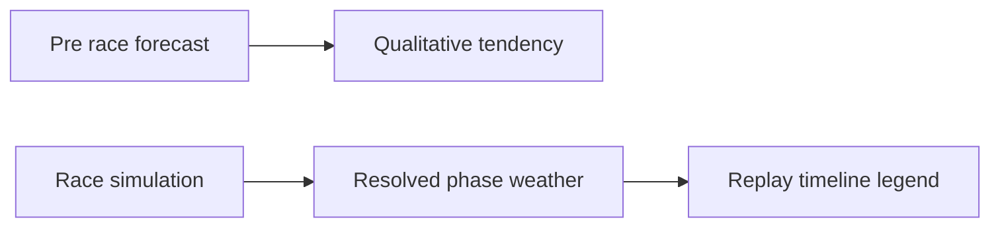

## prod_043_weather_legibility_product_brief - Weather Legibility Product Brief
> Date: 2026-07-21
> Status: Settled
> Related request: `req_079_clarify_weather_semantics_forecast_vs_resolved_and_pace_marker_legend`
> Related backlog: `item_177_label_forecast_vs_resolved_weather_and_add_a_replay_legend`
> Related task: `task_080_orchestrate_weather_forecast_legibility`
> Related architecture: (none yet)
> Reminder: Update status, linked refs, scope, decisions, success signals, and open questions when you edit this doc.

# Overview
Make weather understandable by clearly separating the pre-race forecast (a probability, not a promise) from the actual per-phase weather shown in the replay, and by explaining the pace marker, without changing the weather model.

# Goals
- Let a player tell a forecast apart from the weather that actually happened.
- Explain the replay pace marker and phase mapping so the timeline is self-describing.
- Keep all weather framing honest with the underlying model.
- Preserve uncertainty; do not turn the forecast into a solved prediction.

# Non-goals
- Do not change the weather model, its per-segment rolls, or any simulation behavior.
- Do not display precise per-phase probabilities the model does not apply.
- Do not redesign the weather icon set or colors (already shipped).
- Do not add a charting or UI dependency.

# Scope and guardrails
- In: scaffolded request, product, backlog, orchestration task, validation, and handoff context.
- Out: unrelated workflow docs and implementation of generated tasks.

# Key product decisions
- Keep forecast copy qualitative; do not show per-phase percentages.
- Label replay weather as actual resolved phase weather.
- Explain marker and cloud semantics with text, not color alone.

# Success signals
- Players can distinguish forecast from actual replay weather.
- Replay timeline marker and phase icon meanings are visible in copy.
- Typecheck, lint, unit tests, build, and Logics validation pass.

# References
- Product back-reference: `req_079_clarify_weather_semantics_forecast_vs_resolved_and_pace_marker_legend`
- Task back-reference: `task_080_orchestrate_weather_forecast_legibility`
