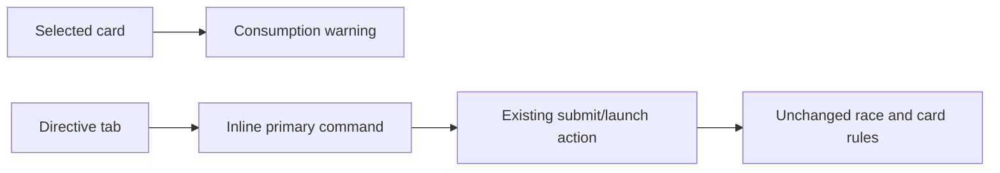

## prod_044_plan_commit_clarity_product_brief - Plan Commit Clarity Product Brief
> Date: 2026-07-21
> Status: Settled
> Related request: `req_080_warn_card_consumption_before_commit_and_add_an_inline_launch_action_on_the_directive_tab`
> Related backlog: `item_178_add_pre_commit_card_consumption_warning_and_inline_directive_launch_action`
> Related task: `task_081_orchestrate_plan_commit_clarity`
> Related architecture: (none yet)
> Reminder: Update status, linked refs, scope, decisions, success signals, and open questions when you edit this doc.

# Overview
Reduce first-session confusion at the moment of committing a race plan: make card consumption explicit before it happens and let the player launch from the directive tab without hunting for the action.

# Goals
- Make the cost of playing a card (its consumption) visible before commit.
- Let the player launch or send from the directive tab in one place.
- Reuse the existing primaryCommand so behavior stays consistent.
- Ship the smallest safe change with no model impact.

# Non-goals
- Do not change card consumption rules, banking, or resale.
- Do not change the simulation, rewards, or any API contract.
- Do not add a second competing launch button or fork launch logic.
- Do not redesign the plan navigation or subtab structure.

# Scope and guardrails
- In: selected-card consumption warning inside the directive card selector.
- In: directive-tab inline action that reuses the resolved `primaryCommand` label, action, and disabled state.
- In: EN/FR copy and focused component coverage.
- Out: card consumption rules, banking, resale, simulation, rewards, API contracts, and plan navigation redesign.

# Key product decisions
- Warn only when a real card is selected; "No card" remains a saving choice without extra noise.
- Reuse the existing `primaryCommand` rather than branching submit/launch behavior inside the directive panel.
- Keep the inline command compact and local to the directive selection panel.

# Success signals
- A selected card shows pre-commit consumption copy in EN/FR.
- The directive tab can send or launch through the same command used elsewhere.
- Full validation passes without model, API, reward, or consumption-rule changes.

# References
- Product back-reference: `req_080_warn_card_consumption_before_commit_and_add_an_inline_launch_action_on_the_directive_tab`
- Task back-reference: `task_081_orchestrate_plan_commit_clarity`
